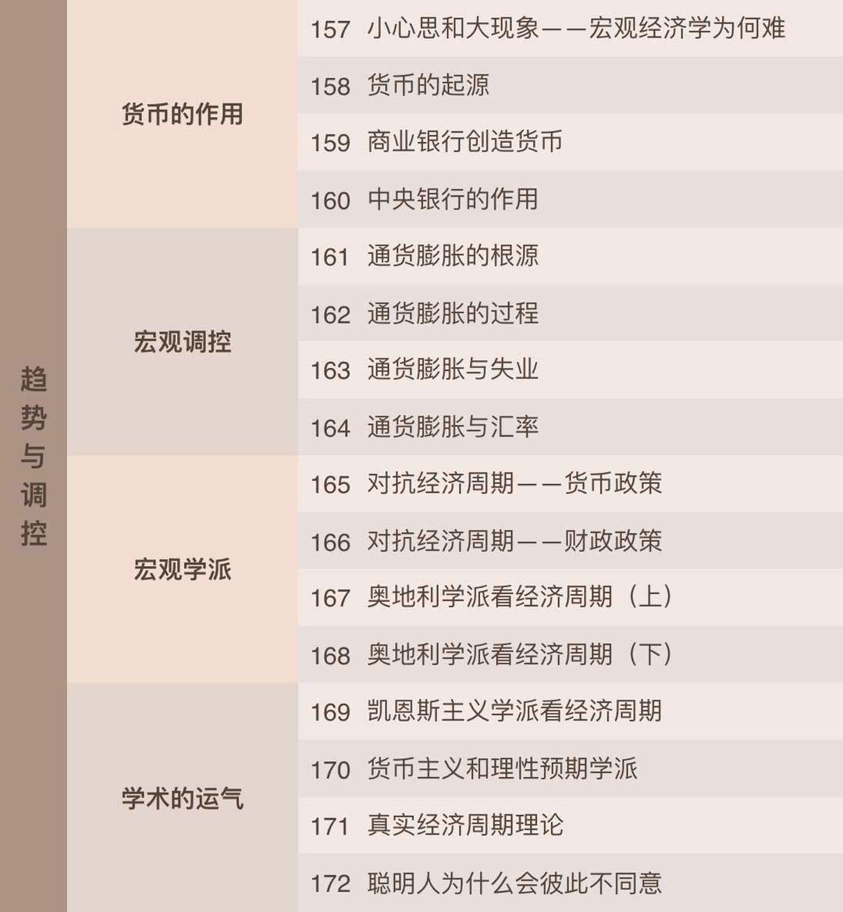

# 薛兆丰的经济学课

## 课程大纲

### 1. 人性与稀缺

### 2. 成本的深义

### 3. 需求的规律

### 4. 价格的作用

### 5. 权利的安排

### 6. 耐心的回报

### 7. 生产的规划

### 8. 信任的建立

### 9. 依存于对抗

### 10. 公司的结构

### 11. 竞争的逻辑

### 12. 趋势与调控

### 13. 政治与法律

### 14. 读厚与读薄

