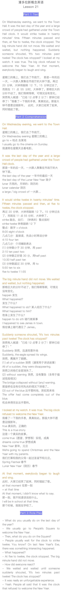

# 新概念第二册上 Lesson 20 - 26

## Lesson 20 - A Cold Welcome

refuse (v) 拒绝，回绝

I refuse to believe them. 

我拒绝相信他们。

say no 说不

They asked me so nicely that I couldn’t really say no.

他们如此恳切相求，我真的没法拒绝。

turn sb / sth down  拒绝提议，邀请

They offered me the job but I turned it down.

他们给我这份工作，不过我拒绝了。

decline 谢绝，礼貌的拒绝。

She has declined all offers of help.

她谢绝了所有人的帮助。

## Lesson 21 - A Cold Welcome

## Lesson 22 - 复习

while 不要求动作同时发生

as 一般指动作同时发生

## Lesson 23 - Not For Jazz

destroy & ruin & break & damage

## Lesson 24 -

## Lesson 25 - 

## Lesson 26 -

