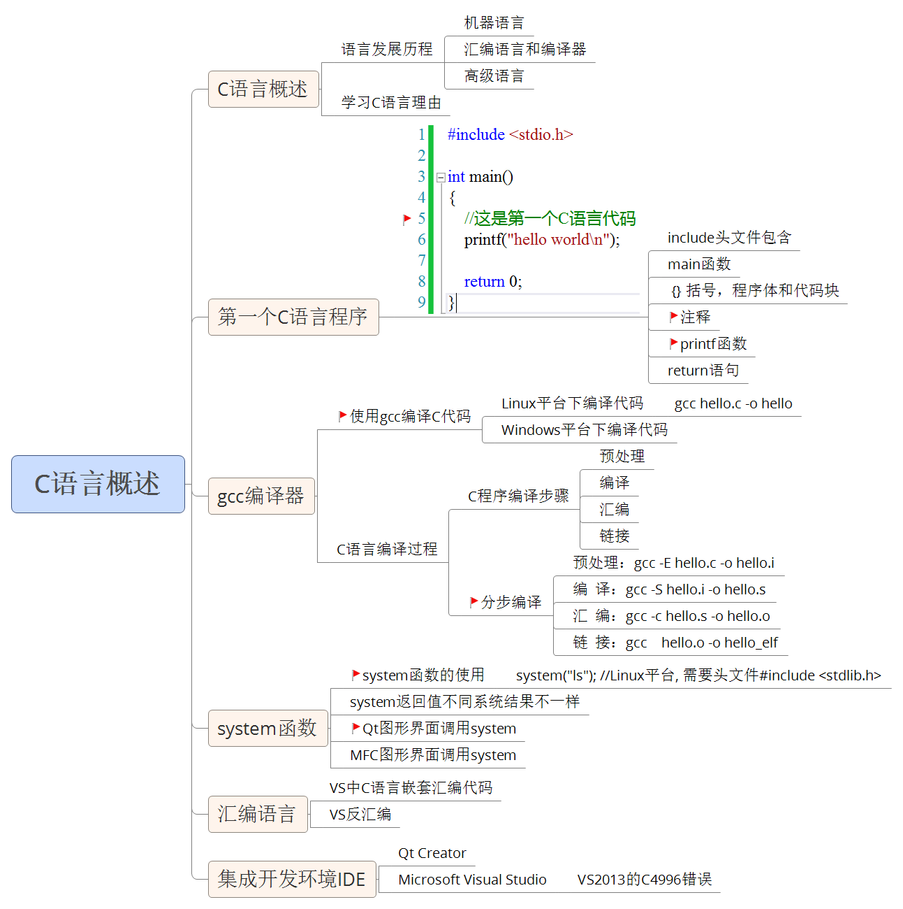

# 建立ARM交叉编译环境arm-none-linux-gnueabi-gcc

```shell
# add2line：将你要找的地址转成文件和行号，它要使用 debug 信息
arm-none-linux-gnueabi-addr2line 

# ar：产生、修改和解开一个存档文件
arm-none-linux-gnueabi-ar 

# as：gnu的汇编器
arm-none-linux-gnueabi-as   

# ld：gnu 的连接器
arm-none-linux-gnueabi-ld 

# gprof：gnu 汇编器预编译器
arm-none-linux-gnueabi-gprof 

# nm：列出目标文件的符号和对应的地址
arm-none-linux-gnueabi-nm      

# objdump：显示目标文件的信息
arm-none-linux-gnueabi-objdump 

# readelf：显示 elf 格式的目标文件的信息
arm-none-linux-gnueabi-readelf 

# strings：打印出目标文件中可以打印的字符串，有个默认的长度，为4
arm-none-linux-gnueabi-strings 

# c++filt：C++ 和 java 中有一种重载函数，所用的重载函数最后会被编译转化成汇编的标，c++filt 就是实现这种反向的转化，根据标号得到函数名
arm-none-linux-gnueabi-c++filt 

# objcopy：将某种格式的目标文件转化成另外格式的目标文件
arm-none-linux-gnueabi-objcopy 

# ranlib：为一个存档文件产生一个索引，并将这个索引存入存档文件中
arm-none-linux-gnueabi-ranlib  

# size：显示目标文件各个节的大小和目标文件的大小
arm-none-linux-gnueabi-size    

# strip：剥掉目标文件的所有的符号信息
arm-none-linux-gnueabi-strip
```

# C调用C++库和C++调用C库的方法

> [C调用C++库和C++调用C库的方法](https://blog.csdn.net/shaosunrise/article/details/81176880)

## C++调用C的静态库/动态库

C++ 调用 C 的函数比较简单，直接使用 `extern "C" {}` 告诉编译器用 C 的规则去调用 C 函数就可以了。

**CAdd.h**

```c
int cadd(int x, int y);
```

**CAdd.c**

```c
#include "CAdd.h"
#include <stdio.h>

int cadd(int x, int y) {
	printf("from C function.\n");
	return (x + y);
}
```

**编译libCAdd.a**

```shell
gcc -c CAdd.c           # 生成CAdd.o
ar -r libCAdd.a CAdd.o  # 归档生成libCAdd.a
```

**编译动态库 libCAdd.so**

```shell
gcc -shared -o libCAdd.so CAdd.c
```

**cppmain.cpp**

```c
#include <stdio.h>

extern "C" {
	#include "CAdd.h"
}

int main()
{
    int sum = cadd(1, 2);
    printf("1+2 = %d\n", sum);
    return 0;
}
```

**编译main**

`-l` 指定库名称，优先链接so动态库，没有动态库再链接 `.a` 静态库。

```shell
g++ -o cppmain cppmain.cpp -L. -lCAdd
```

**运行** 

如果链接的是静态库就可以直接运行了，如果链接的是动态库可能会提示 

```sehll
./cppmain: error while loading shared libraries: libCAdd.so: cannot open shared object file: No such file or directory
```

是因为Linux系统程序和Windows不一样，Linux系统只会从系统环境变量指定的路径加载动态库，可以把生成的动态库放到系统目录，或者执行 `export LD_LIBRARY_PATH=./` 设置当前路径为系统链接库目录就可以了。

**注释 **

这里是在 include 头文件的外面包裹了 `extern "C" { }`，是告诉编译器以 C 语言的命名方式去加载这个符号。还有一种比较常见的方式是在头文件中进行编译声明，如下所示，这样的话，无论 C 还是 C++ 直接正常include就可以使用了。

**CAdd.h**

```c

```

## C 调用 C++ 的静态库

C 语言没法直接调用 C++ 的函数，**但可以使用包裹函数来实现**。C++ 文件 `.cpp` 中可以调用 C 和 C++ 的函数，但是 C 代码 `.c` 只能调用 C 的函数，所以可以用包裹函数去包裹C ++ 函数，然后把这个包裹函数以 C 的规则进行编译，这样 C 就可以调用这个包裹函数了。

**CppAdd.h**

```c
int cppadd(int x, int y);
```

**CppAdd.cpp**

```c
#include "CppAdd.h"
#include <stdio.h>

int cppadd(int x, int y) {
    printf("from C++ function.\n");
    return (x + y);
}
```

**编译静态库 libCppAdd.a**

```shell
g++ -c CppAdd.cpp
ar -r libCppAdd.a CppAdd.o
```

**CppAddWrapper.h**

```c
#ifdef __cplusplus
extern "C" {
#endif

int cppaddwrapper(int x, int y);

#ifdef __cplusplus
}
#endif
```

**CppAddWrapper.cpp**

```c
#include "CppAddWrapper.h"
#include <stdio.h>
#include "CppAdd.h"

int cppaddwrapper(int x, int y) {
    printf("from wrapper.\n");
    int sum = cppadd(x, y);
    return sum;
}
```

**编译 wrapper 静态库 libCppAddWrapper.a**

```shell
g++ -c CppAddWrapper.cpp
ar -r libCppAddWrapper.a CppAddWrapper.o
```

**main.c**

```c
#include "CppAddWrapper.h"
#include <stdio.h>

int main()
{
  int sum = cppaddwrapper(1, 2);
  printf("1+2 = %d\n", sum);
  return 0;
}
```

**编译 main，同时指定 libCppAdd.a 和 libCppAddWrapper.a。**

```shell
gcc -o main main.c -L. -lCppAddWrapper -lCppAdd
```

或者把 libCppAdd.a 合并到 libCppAddWrapper.a 中

```shell
ar -x libCppAdd.a         # 提取CppAdd.o
ar -x libCppAddWrapper.a  # 提取CppAddWrapper.o
ar -r libCppAddWrapper.a CppAdd.o CppAddWrapper.o # 打包libCppAddWrapper.a
gcc -o main main.c -L. -lCppAddWrapper  # 只需要连接libCppAddWrapper.a即可
```


如果是 C 调用 C++ 的 so 动态库的话，类似于调用静态库的方法应该也是有效的，太麻烦我没试过。

## 总结

**C/C++ 函数符号的区别**

C++ 可以兼容 C 的语法，C/C++ 主要的区别是编译函数符号规则不一样，C 语言代码编译后的函数名还是原来函数名，C++ 代码编译后的函数名带有参数信息。 

做个测试来检验一下。一个简单的函数，分别用 C 和 C++ 进行编译。 

**hello1.c**

```c
int test(int a, char* b){
    return a;
}
```

**hello2.cpp**

```c
int test(int a, char* b){
    return a;
}
```

**编译**

```shell
gcc -c hello1.c     # 生成hello1.o
g++ -c hello1.cpp   # 生成hello2.o
```

**查看符号表**

```shell
$ nm hello1.o
0000000000000000 T test
$ nm hello2.o
0000000000000000 T _Z4testiPc
```

从上面信息可以看出，C 语言编译后的函数符号还是原函数名，而 C++ 编译后的函数符号由test变成了 `_Z4testiPc`，从这个符号名字可以看出 test 前面有个数字 4 应该是函数名长度，test 后面 `iPc` 应该就是函数的参数签名。C++ 之所以这样规定编译后的函数符号是因为对面对象的 C++ 具有函数重载功能，以此来区分不同的函数。

**.so 动态库、.a 静态库和 .o 中间文件的关系**

程序的运行都要经过**编译和链接**两个步骤。假如有文件 `add.c`，可以使用命令 `gcc -c add.c` 进行编译，生成 add.o 中间文件，使用命令 `ar -r libadd.a add.o` 可以生成 `libadd.a` 静态库文件。静态库文件其实就是对 `.o` 中间文件进行的封装，使用 `nm libadd.a` 命令可以查看其中封装的中间文件以及函数符号。 

链接静态库就是链接静态库中的 `.o` 文件，这和直接编译多个文件再链接成可执行文件一样。 

动态链接库是程序执行的时候直接调用的“插件”，使用命令 `gcc -shared -o libadd.so add.c` 生成 so 动态库。动态库链接的时候可以像静态库一样链接，告诉编译器函数的定义在这个静态库中（避免找不到函数定义的错误），只是不把这个 so 打包到可执行文件中。如果没有头文件的话，可以使用 `dlopen/dlsum` 函数手动去加载相应的动态库。详细做法参考上一篇文章《[C语言调用so动态库的两种方式](https://blog.csdn.net/shaosunrise/article/details/81161064)》。

