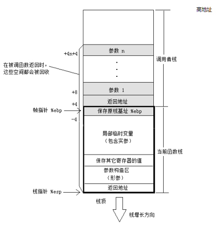
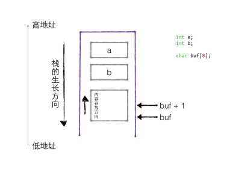
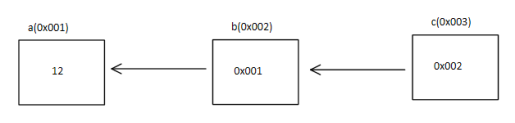

# C 语言进阶

## 一、 内存分区

栈区

- 由系统进行内存的管理。主要存放函数的参数以及局部变量。在函数完成执行，系统自行释放栈区内存，不需要用户管理。

堆区

- 由编程人员手动申请，手动释放，若不手动释放，程序结束后由系统回收，生命周期是整个程序运行期间。使用malloc或者new进行堆的申请。

```c
#include <stdlib.h>
void *calloc(size_t nmemb, size_t size);
功能：在内存动态存储区中分配nmemb块长度为size字节的连续区域。calloc自动将分配的内存置0。
参数：
	nmemb：所需内存单元数量
	size：每个内存单元的大小（单位：字节）
返回值：
	成功：分配空间的起始地址
	失败：NULL

#include <stdlib.h>
void *realloc(void *ptr, size_t size);
功能：重新分配用malloc或者calloc函数在堆中分配内存空间的大小。realloc不会自动清理增加的内存，需要手动清理，如果指定的地址后面有连续的空间，那么就会在已有地址基础上增加内存，如果指定的地址后面没有空间，那么realloc会重新分配新的连续内存，把旧内存的值拷贝到新内存，同时释放旧内存。
参数：
	ptr：为之前用malloc或者calloc分配的内存地址，如果此参数等于NULL，那么和realloc与malloc功能一致
	size：为重新分配内存的大小, 单位：字节
返回值：
	成功：新分配的堆内存地址
	失败：NULL
```

全局/静态区

- 全局静态区内的变量在编译阶段已经分配好内存空间并初始化。这块内存在程序运行期间一直存在,它主要存储**全局变量**、**静态变量**和**常量**。

  **注意**：

  - 这里不区分初始化和未初始化的数据区，是因为静态存储区内的变量若不显示初始化，则编译器会自动以默认的方式进行初始化，即静态存储区内不存在未初始化的变量。
  - 全局静态存储区内的常量分为常变量和字符串常量，一经初始化，不可修改。静态存储内的常变量是全局变量，与局部常变量不同，区别在于局部常变量存放于栈，实际可间接通过指针或者引用进行修改，而全局常变量存放于静态常量区则不可以间接修改。
  - 字符串常量存储在全局/静态存储区的常量区。

```c
int v1 = 10;//全局/静态区
const int v2 = 20; //常量，一旦初始化，不可修改
static int v3 = 20; //全局/静态区
char *p1; //全局/静态区，编译器默认初始化为NULL

//那么全局static int 和 全局int变量有什么区别？

void test(){
	static int v4 = 20; //全局/静态区
}
```

**字符串常量是否可修改？字符串常量优化**：

| ANSI C中规定：修改字符串常量，结果是未定义的。<br />ANSI C并没有规定编译器的实现者对字符串的处理，例如：<br />1. 有些编译器可修改字符串常量，有些编译器则不可修改字符串常量。<br />2. 有些编译器把多个相同的字符串常量看成一个（这种优化可能出现在字符串常量中，节省空间），有些则不进行此优化。如果进行优化，则可能导致修改一个字符串常量导致另外的字符串常量也发生变化，结果不可知。<br />**所以尽量不要去修改字符串常量**！ |
| ------------------------------------------------------------ |
| C99标准：<br />char *p = "abc"; defines p with type ‘‘pointer to char’’ and initializes it to point to an object with type ‘‘array of char’’ with length 4 whose elements are initialized with a character string literal. **If an attempt is made to use p to modify the contents of the array, the behavior is undefined**. |

**总结**

在理解C/C++内存分区时，常会碰到如下术语：数据区，堆，栈，静态区，常量区，全局区，字符串常量区，文字常量区，代码区等等，初学者被搞得云里雾里。在这里，尝试捋清楚以上分区的关系。

**数据区包括**：堆，栈，全局/静态存储区。

**全局/静态存储区包括**：常量区，全局区、静态区。

**常量区包括**：字符串常量区、常变量区。

**代码区**：存放程序编译后的二进制代码，不可寻址区。

**可以说，C/C++内存分区其实只有两个，即代码区和数据区**。


函数调用模型：

- 在经典的操作系统中，栈总是向下增长的。压栈的操作使得栈顶的地址减小，弹出操作使得栈顶地址增大。

栈在程序运行中具有极其重要的地位。最重要的，栈保存一个函数调用所需要维护的信息，这通常被称为堆栈帧(Stack Frame)或者活动记录(Activate Record).一个函数调用过程所需要的信息一般包括以下几个方面：

- 函数的返回地址；
- 函数的参数；
- 临时变量；
- 保存的上下文：包括在函数调用前后需要保持不变的寄存器。



栈的生长方向和内存存放方向：



## 二、指针强化

**指针是一种数据类型，占用内存空间，用来保存内存地址**。

### 2.1 野指针和空指针

#### 2.1.1 空指针

标准定义了NULL指针，它作为一个特殊的指针变量，表示不指向任何东西。要使一个指针为NULL,可以给它赋值一个零值。为了测试一个指针百年来那个是否为NULL,你可以将它与零值进行比较。

对指针解引用操作可以获得它所指向的值。但从定义上看，NULL指针并未执行任何东西，因为对一个NULL指针因引用是一个非法的操作，在解引用之前，必须确保它不是一个NULL指针。

如果对一个NULL指针间接访问会发生什么呢？结果因编译器而异。

**不允许向NULL和非法地址拷贝内存**：

```c
void test(){
	char *p = NULL;
	//给p指向的内存区域拷贝内容
	strcpy(p, "1111"); //err

	char *q = 0x1122;
	//给q指向的内存区域拷贝内容
	strcpy(q, "2222"); //err		
}
```

#### 2.1.2 野指针

**在使用指针时，要避免野指针的出现**：

野指针指向一个已删除的对象或未申请访问受限内存区域的[指针](http://baike.baidu.com/view/159417.htm)。与空指针不同，野指针无法通过简单地判断是否为 [NULL](http://baike.baidu.com/view/329484.htm)避免，而只能通过养成良好的编程习惯来尽力减少。对野指针进行操作很容易造成程序错误。

**什么情况下会导致野指针**？

- **指针变量未初始化**
  - 任何指针变量刚被创建时不会自动成为NULL指针，它的缺省值是随机的，它会乱指一气。所以，指针变量在创建的同时应当被初始化，要么将指针设置为NULL，要么让它指向合法的内存。

- **指针释放后未置空**
  - 有时指针在free或delete后未赋值 NULL，便会使人以为是合法的。别看free和delete的名字（尤其是delete），它们只是把指针所指的内存给释放掉，但并没有把指针本身干掉。此时指针指向的就是“垃圾”内存。释放后的指针应立即将指针置为NULL，防止产生“野指针”。

- **指针操作超越变量作用域**
  - **不要返回指向栈内存的指针或引用，因为栈内存在函数结束时会被释放**。

**操作野指针是非常危险的操作，应该规避野指针的出现**：

- **初始化时置 NULL**
  - 指针变量一定要初始化为NULL，因为任何指针变量刚被创建时不会自动成为NULL指针，它的缺省值是随机的。

- **释放时置 NULL**
  - 当指针p指向的内存空间释放时，没有设置指针p的值为NULL。delete和free只是把内存空间释放了，但是并没有将指针p的值赋为NULL。通常判断一个指针是否合法，都是使用if语句测试该指针是否为NULL。

**用指针作为函数返回值时需要注意的一点是，函数运行结束后会销毁在它内部定义的所有局部数据，包括局部变量、局部数组和形式参数，函数返回的指针请尽量不要指向这些数据**，C语言没有任何机制来保证这些数据会一直有效，它们在后续使用过程中可能会引发运行时错误。请看下面的例子：

```c
#include <stdio.h>
int *func(){
    int n = 100;
    return &n;
}
int main(){
    int *p = func(), n;
    n = *p;
    printf("value = %d\n", n);
    return 0;
}
```

运行结果：

```c
value = 100
```

 n 是 func() 内部的局部变量，func() 返回了指向 n 的指针，根据上面的观点，func() 运行结束后 n 将被销毁，使用 `*p` 应该获取不到 n 的值。但是从运行结果来看，我们的推理好像是错误的，func() 运行结束后 `*p` 依然可以获取局部变量 n 的值，这个上面的观点不是相悖吗？

为了进一步看清问题的本质，不妨将上面的代码稍作修改，在第9~10行之间增加一个函数调用，看看会有什么效果：  

```c
#include <stdio.h>
int *func(){
    int n = 100;
    return &n;
}
int main(){
    int *p = func(), n;
    printf("c.biancheng.net\n");
    n = *p;
    printf("value = %d\n", n);
    return 0;
}
```

运行结果：

```c
c.biancheng.net
value = -2
```

可以看到，现在 p 指向的数据已经不是原来 n 的值了，它变成了一个毫无意义的甚至有些怪异的值。与前面的代码相比，该段代码仅仅是在 `*p` 之前增加了一个函数调用，这一细节的不同却导致运行结果有天壤之别，究竟是为什么呢？

前面我们说函数运行结束后会销毁所有的局部数据，这个观点并没错，大部分C语言教材也都强调了这一点。但是，这里所谓的销毁并不是将局部数据所占用的内存全部抹掉，而是程序放弃对它的使用权限，弃之不理，后面的代码可以随意使用这块内存。对于上面的两个例子，func() 运行结束后 n 的内存依然保持原样，值还是 100，如果使用及时也能够得到正确的数据，如果有其它函数被调用就会覆盖这块内存，得到的数据就失去了意义。

> 关于函数调用的原理以及函数如何占用内存的更多细节，我们将在《[C语言和内存](http://c.biancheng.net/cpp/u/c20/)》专题中深入探讨，相信你必将有所顿悟，解开心中的谜团。

第一个例子在调用其他函数之前使用 `*p` 抢先获得了 n 的值并将它保存起来，第二个例子显然没有抓住机会，有其他函数被调用后才使用 `*p` 获取数据，这个时候已经晚了，内存已经被后来的函数覆盖了，而覆盖它的究竟是一份什么样的数据我们无从推断（一般是一个没有意义甚至有些怪异的值）。

**总结**：

常规程序中，函数返回的指针通常应该是：

- 指向静态（static）变量；
- 指向专门申请分配的（如用malloc）空间；
- 指向常量区（如指向字符串"hello"）；
- 指向全局变量；
- 指向程序代码区（如指向函数的指针）。 

除这5项以外，其它怪技巧不提倡。

**函数内的变量，没有关键字static修饰的变量的生命周期只在本函数内，函数结束后变量自动销毁**。当返回为指针的时候需要特别注意，因为**函数结束后指针所指向的地址依然存在，但是该地址可以被其他程序修改，里面的内容就不确定了，有可能后面的操作会继续用到这块地址，有可能不会用到，所以会出现时对时错的情况，如果需要返回一个指针而又不出错的话只能调用内存申请函数**

### 2.2 间接访问操作符

通过一个指针访问它所指向的地址的过程叫做间接访问，或者叫解引用指针，这个用于执行间接访问的操作符是 `*`。

注意：对一个`int*`类型指针解引用会产生一个整型值，类似地，对一个`float*`指针解引用会产生了一个float类型的值。

- 在指针声明时，`*` 号表示所声明的变量为指针

- 在指针使用时，`*` 号表示操作指针所指向的内存空间
  - `*` 相当通过地址(指针变量的值)找到指针指向的内存，再操作内存
  - `*` 放在等号的左边赋值（给内存赋值，写内存）
  - `*` 放在等号的右边取值（从内存中取值，读内存）

```c
//解引用
void test01(){

	//定义指针
	int* p = NULL;
	//指针指向谁，就把谁的地址赋给指针
	int a = 10;
	p = &a;
	*p = 20;//*在左边当左值，必须确保内存可写
	//*号放右面，从内存中读值
	int b = *p;
	//必须确保内存可写
	char* str = "hello world!";
	*str = 'm';
    printf("a:%d\n", a);
	printf("*p:%d\n", *p);
	printf("b:%d\n", b);
}
```

### 2.3 **指针的步长**

指针是一种数据类型，是指它指向的内存空间的数据类型。指针所指向的内存空间决定了指针的步长。指针的步长指的是，当指针+1时候，移动多少字节单位。

### 2.4 指针的意义_间接赋值

通过指针间接赋值成立的三大条件：

- 2个变量（一个普通变量一个指针变量、或者一个实参一个形参）

- 建立关系

- 通过 `*` 操作指针指向的内存

```c
void test(){
	int a = 100;	//两个变量
	int *p = NULL;
	//建立关系
	//指针指向谁，就把谁的地址赋值给指针
	p = &a;
	//通过*操作内存
	*p = 22;
}
```

间接赋值：从1级指针到2级指针：

```c
void AllocateSpace(char** p){
	*p = (char*)malloc(100);
	strcpy(*p, "hello world!");
}

void FreeSpace(char** p){

	if (p == NULL){
		return;
	}
	if (*p != NULL){
		free(*p);
		*p = NULL;
	}

}

void test(){
	
	char* p = NULL;

	AllocateSpace(&p);
	printf("%s\n",p);
	FreeSpace(&p);
    if (p == NULL){
		printf("p内存释放!\n");
	}
}
```

**间接赋值的推论**：

- 用 1 级指针形参，去间接修改了 0 级指针(实参)的值。

- 用 2 级指针形参，去间接修改了 1 级指针(实参)的值。

- 用 3 级指针形参，去间接修改了 2 级指针(实参)的值。

- 用 n 级指针形参，去间接修改了 n-1 级指针(实参)的值。

### 2.5 指针做函数参数

指针做函数参数，具备输入和输出特性：

- 输入：主调函数分配内存

- 输出：被调用函数分配内存

输入特性：

```c
void fun(char *p /* in */)
{
	//给p指向的内存区域拷贝内容
	strcpy(p, "abcddsgsd");
}

void test(void)
{
	//输入，主调函数分配内存
	char buf[100] = { 0 };
	fun(buf);
	printf("buf  = %s\n", buf);
}
```

输出特性：

```c
void fun(char **p /* out */, int *len)
{
	char *tmp = (char *)malloc(100);
	if (tmp == NULL)
	{
		return;
	}
	strcpy(tmp, "adlsgjldsk");

	//间接赋值
	*p = tmp;
	*len = strlen(tmp);
}

void test(void)
{
	//输出，被调用函数分配内存，地址传递
	char *p = NULL;
	int len = 0;
	fun(&p, &len);
	if (p != NULL)
	{
		printf("p = %s, len = %d\n", p, len);
	}
}
```

### 2.6 字符串指针强化

**字符串是以0或者'\0'结尾的字符数组，(数字0和字符'\0'等价)**

**如果以字符串初始化，那么编译器默认会在字符串尾部添加'\0'**

```c
char str3[] = "hello";
```

- sizeof 计算数组大小，数组包含'\0'字符

- strlen 计算字符串的长度，到'\0'结束

字符串拷贝功能实现：

```c
//1）应该判断下传入的参数是否为NULL
//2）最好不要直接使用形参
int copy_string04(char* dest, char* source){
	if (dest == NULL){
        return -1;
	}
	if (source == NULL){
		return -2;
	}

	char* src = source;
	char* tar = dest;

	while (*tar++ = *src++){}

	return 0;
}
```

字符串的格式化：

```c
#include <stdio.h>
int sprintf(char *str, const char *format, ...);
功能：
     根据参数format字符串来转换并格式化数据，然后将结果输出到str指定的空间中，直到出现字符串结束符 '\0' 为止。
参数： 
	str：字符串首地址
	format：字符串格式，用法和printf()一样
返回值：
	成功：实际格式化的字符个数
	失败： - 1
```

```c
//1. 格式化字符串
char buf[1024] = { 0 };
sprintf(buf, "你好,%s,欢迎加入我们!", "John");
printf("buf:%s\n",buf);

memset(buf, 0, 1024);
sprintf(buf, "我今年%d岁了!", 20);
printf("buf:%s\n", buf);

//2. 拼接字符串
memset(buf, 0, 1024);
char str1[] = "hello";
char str2[] = "world";
int len = sprintf(buf,"%s %s",str1,str2);
printf("buf:%s len:%d\n", buf,len);

//3. 数字转字符串
memset(buf, 0, 1024);
int num = 100;
sprintf(buf, "%d", num);
printf("buf:%s\n", buf);
//设置宽度 右对齐
memset(buf, 0, 1024);
sprintf(buf, "%8d", num);
printf("buf:%s\n", buf);
//设置宽度 左对齐
memset(buf, 0, 1024);
sprintf(buf, "%-8d", num);
printf("buf:%s\n", buf);
```

```c
#include <stdio.h>
int sscanf(const char *str, const char *format, ...);
功能：
    从str指定的字符串读取数据，并根据参数format字符串来转换并格式化数据。
参数：
	str：指定的字符串首地址
	format：字符串格式，用法和scanf()一样
返回值：
	成功：实际读取的字符个数
	失败： - 1
```

| **格式**   | **作用**                           |
| ---------- | ---------------------------------- |
| `%*s或%*d` | 跳过数据                           |
| %[width]s  | 读指定宽度的数据                   |
| %[a-z]     | 匹配a到z中任意字符(尽可能多的匹配) |
| %[aBc]     | 匹配a、B、c中一员，贪婪性          |
| `%[^a]`    | 匹配非a的任意字符，贪婪性          |
| `%[^a-z]`  | 表示读取除a-z以外的所有字符        |

```c
//1. 跳过数据
void test01(){
	char buf[1024] = { 0 };
	//跳过前面的数字
	//匹配第一个字符是否是数字，如果是，则跳过
	//如果不是则停止匹配
	sscanf("123456aaaa", "%*d%s", buf); 
	printf("buf:%s\n",buf);
}

//2. 读取指定宽度数据
void test02(){
	char buf[1024] = { 0 };
	//跳过前面的数字
	sscanf("123456aaaa", "%7s", buf);
	printf("buf:%s\n", buf);
}

//3. 匹配a-z中任意字符
void test03(){
	char buf[1024] = { 0 };
	//跳过前面的数字
  	//先匹配第一个字符，判断字符是否是a-z中的字符，如果是匹配
	//如果不是停止匹配
	sscanf("abcdefg123456", "%[a-z]", buf);
	printf("buf:%s\n", buf);
}

//4. 匹配aBc中的任何一个
void test04(){
	char buf[1024] = { 0 };
	//跳过前面的数字
	//先匹配第一个字符是否是aBc中的一个，如果是，则匹配，如果不是则停止匹配
	sscanf("abcdefg123456", "%[aBc]", buf);
	printf("buf:%s\n", buf);
}

//5. 匹配非a的任意字符
void test05(){
	char buf[1024] = { 0 };
	//跳过前面的数字
	//先匹配第一个字符是否是aBc中的一个，如果是，则匹配，如果不是则停止匹配
	sscanf("bcdefag123456", "%[^a]", buf);
	printf("buf:%s\n", buf);
}

//6. 匹配非a-z中的任意字符
void test06(){
	char buf[1024] = { 0 };
	//跳过前面的数字
	//先匹配第一个字符是否是aBc中的一个，如果是，则匹配，如果不是则停止匹配
	sscanf("123456ABCDbcdefag", "%[^a-z]", buf);
	printf("buf:%s\n", buf);
}  
```

#### 2.6.1 一级指针易错点

- 越界
- 指针叠加会不断改变指针指向 `p++`

- 返回局部变量地址

```c
char *get_str()
{
	char str[] = "abcdedsgads"; //栈区，
	printf("[get_str]str = %s\n", str);
	return str;
}
```

- 同一块内存释放多次
  - free()函数的功能只是告诉系统 p 指向的内存可以回收了。就是说，p 指向的内存使用权交还给系统。但是，p的值还是原来的值(野指针)，p还是指向原来的内存

### 2.7 const使用

```c
//const修饰变量
void test01(){
	//1. const基本概念
	const int i = 0;
	//i = 100; //错误，只读变量初始化之后不能修改

	//2. 定义const变量最好初始化
	const int j;
	//j = 100; //错误，不能再次赋值

	//3. c语言的const是一个只读变量，并不是一个常量，可通过指针间接修改
	const int k = 10;
	//k = 100; //错误，不可直接修改，我们可通过指针间接修改
	printf("k:%d\n", k);
	int* p = &k;
	*p = 100;
	printf("k:%d\n", k);
}

//const 修饰指针
void test02(){

	int a = 10;
	int b = 20;
	//const放在*号左侧 修饰p_a指针指向的内存空间不能修改,但可修改指针的指向
	const int* p_a = &a;
	//*p_a = 100; //不可修改指针指向的内存空间
	p_a = &b; //可修改指针的指向

	//const放在*号的右侧， 修饰指针的指向不能修改，但是可修改指针指向的内存空间
	int* const p_b = &a;
	//p_b = &b; //不可修改指针的指向
	*p_b = 100; //可修改指针指向的内存空间

	//指针的指向和指针指向的内存空间都不能修改
	const int* const p_c = &a;
}
//const指针用法
struct Person{
	char name[64];
	int id;
	int age;
	int score;
};

//每次都对对象进行拷贝，效率低，应该用指针
void printPersonByValue(struct Person person){
	printf("Name:%s\n", person.name);
	printf("Name:%d\n", person.id);
	printf("Name:%d\n", person.age);
	printf("Name:%d\n", person.score);
}

//但是用指针会有副作用，可能会不小心修改原数据
void printPersonByPointer(const struct Person *person){
	printf("Name:%s\n", person->name);
	printf("Name:%d\n", person->id);
	printf("Name:%d\n", person->age);
	printf("Name:%d\n", person->score);
}
void test03(){
	struct Person p = { "Obama", 1101, 23, 87 };
	//printPersonByValue(p);
	printPersonByPointer(&p);
}
```

## 三、指针的指针(二级指针)

```c
int a = 12;
int *b = &a;
int **c = &b;
```

它在内存中的大概模样大致如下：



### 3.1 二级指针做形参输出特性

二级指针做参数的输出特性是指由被调函数分配内存。

```c
//被调函数,由参数n确定分配多少个元素内存
void allocate_space(int **arr,int n){
	//堆上分配n个int类型元素内存
	int *temp = (int *)malloc(sizeof(int)* n);
	if (NULL == temp){
		return;
	}
	//给内存初始化值
	int *pTemp = temp;
	for (int i = 0; i < n;i ++){
		//temp[i] = i + 100;
		*pTemp = i + 100;
		pTemp++;
	}
	//指针间接赋值
	*arr = temp;
}
//打印数组
void print_array(int *arr,int n){
	for (int i = 0; i < n;i ++){
		printf("%d ",arr[i]);
	}
	printf("\n");
}
//二级指针输出特性(由被调函数分配内存)
void test(){
	int *arr = NULL;
	int n = 10;
	//给arr指针间接赋值
	allocate_space(&arr,n);
	//输出arr指向数组的内存
	print_array(arr, n);
	//释放arr所指向内存空间的值
	if (arr != NULL){
		free(arr);
		arr = NULL;
	}
}
```

### 3.2 二级指针做形参输入特性

二级指针做形参输入特性是指由主调函数分配内存。

```c
//打印数组
void print_array(int **arr,int n){
	for (int i = 0; i < n;i ++){
		printf("%d ",*(arr[i]));
	}
	printf("\n");
}
//二级指针输入特性(由主调函数分配内存)
void test(){
	
	int a1 = 10;
	int a2 = 20;
	int a3 = 30;
	int a4 = 40;
	int a5 = 50;

	int n = 5;

	int** arr = (int **)malloc(sizeof(int *) * n);
	arr[0] = &a1;
	arr[1] = &a2;
	arr[2] = &a3;
	arr[3] = &a4;
	arr[4] = &a5;

	print_array(arr,n);

	free(arr);
	arr = NULL;
}
```

## 四、位运算

### 4.1 位逻辑运算符

4个位运算符用于整型数据，包括char.将这些位运算符成为位运算的原因是它们对每位进行操作，而不影响左右两侧的位。请不要将这些运算符与常规的逻辑运算符(&& 、||和!)相混淆，常规的位的逻辑运算符对整个值进行操作。

- **按位取反~**

```c
unsigned char a = 2;   //00000010
unsigned char b = ~a;  //11111101
printf("ret = %d\n", a); //ret = 2
printf("ret = %d\n", b); //ret = 253
```

- **位与（AND）: &**
  - 二进制运算符&通过对两个操作数逐位进行比较产生一个新值。对于每个位，只有两个操作数的对应位都是1时结果才为1。

- **位或（OR）: |**
  - 二进制运算符|通过对两个操作数逐位进行比较产生一个新值。对于每个位，如果其中任意操作数中对应的位为1，那么结果位就为1.

- **位异或:**
  - 二进制运算符 `^` 对两个操作数逐位进行比较。对于每个位，如果操作数中的对应位有一个是1(但不是都是1)，那么结果是1.如果都是0或者都是1，则结果位0.

```c
  (10010011) 
^ (00111101)
= (10101110)
```

**用法**：

- 打开位

已知：10011010：
1. 将位2打开

   `flag | 10011010`

```c
  (10011010)
| (00000100)
= (10011110)
```

2. 将所有位打开。

   `flag | ~flag`

```c
  (10011010)
| (01100101)
= (11111111)
```

- 关闭位

  `flag & ~flag`

```c
  (10011010)
& (01100101)
= (00000000)
```

- 转置位

  - 转置(toggling)一个位表示如果该位打开，则关闭该位；如果该位关闭，则打开。您可以使用位异或运算符来转置。其思想是如果b是一个位(1或0)，那么如果b为1则 `b^1` 为0，如果b为0，则 `1^b` 为1。无论b的值是0还是1, `0^b` 为b.

  `flag ^ 0xff`

``` c
  (10010011)
^ (11111111)
= (01101100)
```

- 交换两个数不需要临时变量

```c
//a ^ b = temp;
//a ^ temp = b;
//b ^ temp = a
  (10010011)
^ (00100110)
= (10110101)

  (10110101)
^ (00100110)
   10010011

#include <stdio.h>
int main(int argc, char *argv[])
{
    int a = 2, b = 6;

    a = a ^ b;
    b = b ^ a;
    a = a ^ b;

    printf("a = %d b = %d/n", a, b);

    return 0;
}
```

### 4.2 移位运算符

- **左移 <<**

  - 左移运算符 `<<` 将其左侧操作数的值的每位向左移动，移动的位数由其右侧操作数指定。空出来的位用0填充，并且丢弃移出左侧操作数末端的位。在下面例子中，每位向左移动两个位置。

  - 左移一位相当于原值 `*2`.

```c
(10001010) << 2
(00101000)
    
1 << 1 = 2;
2 << 1 = 4;
4 << 1 = 8;
8 << 2 = 32
```

- **右移 >>**
  - 右移运算符 `>>` 将其左侧的操作数的值每位向右移动，移动的位数由其右侧的操作数指定。丢弃移出左侧操作数有段的位。对于unsigned类型，使用0填充左端空出的位。**对于有符号类型，结果依赖于机器。空出的位可能用0填充，或者使用符号(最左端)位的副本填充**。

```c
//有符号值
(10001010) >> 2
(00100010)     //在某些系统上的结果值

(10001010) >> 2
(11100010)     //在另一些系统上的解雇

//无符号值
(10001010) >> 2
(00100010)    //所有系统上的结果值
```

**用法：移位运算符**：

- 移位运算符能够提供快捷、高效（依赖于硬件）对2的幂的乘法和除法。

| number << n | number乘以2的n次幂                     |
| ----------- | -------------------------------------- |
| number >> n | 如果number非负，则用number除以2的n次幂 |

## 五、多维数组

**一维数组**：

- 元素类型角度：数组是相同类型的变量的有序集合
- 内存角度：连续的一大片内存空间

**请问：指针和数组是等价的吗？**

答案是**否定**的。数组名在表达式中使用的时候，编译器才会产生一个指针常量。那么数组在什么情况下不能作为指针常量呢？在以下两种场景下：

- 当数组名作为sizeof操作符的操作数的时候，此时sizeof返回的是整个数组的长度，而不是指针数组指针的长度。
- 当数组名作为&操作符的操作数的时候，此时返回的是一个指向数组的指针，而不是指向某个数组元素的指针常量。

```c
int arr[10];
//arr = NULL; //arr作为指针常量，不可修改
int *p = arr; //此时arr作为指针常量来使用
printf("sizeof(arr):%d\n", sizeof(arr)); //此时sizeof结果为整个数组的长度
printf("&arr type is %s\n", typeid(&arr).name()); //int(*)[10]而不是int*
```


