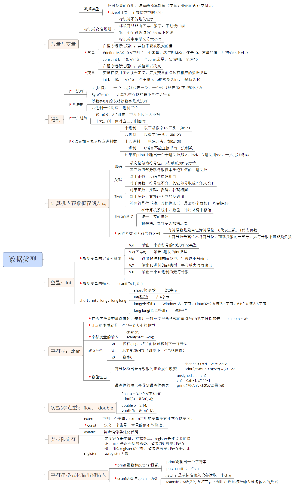

# C 语言基础

## 一、C 语言概述


## 二、数据类型




## Note

- 声明变量不需要建立存储空间，如：extern int a;

- 定义变量需要建立存储空间，如：int b;

- 全局数组若不初始化，编译器将其初始化为零。局部数组若不初始化，内容为随机值。

- 数字 0 (和字符 ‘\0’ 等价)结尾的char数组就是一个字符串，但如果char数组没有以数字0结尾，那么就不是一个字符串，只是普通字符数组，所以字符串是一种特殊的char的数组。

gets(str)与scanf(“%s”,str)的区别：

- gets(str)允许输入的字符串含有空格

- scanf(“%s”,str)不允许含有空格

- 注意：由于scanf()和gets()无法知道字符串s大小，必须遇到换行符或读到文件结尾为止才接收输入，因此容易导致字符数组越界(缓冲区溢出)的情况。

gets() 、puts()

```c
#include <stdio.h>
char *gets(char *s);
功能：从标准输入读入字符，并保存到s指定的内存空间，直到出现换行符或读到文件结尾为止。

int puts(const char *s);
功能：标准设备输出s字符串，在输出完成后自动输出一个'\n'。
```

fgets() 、fputs()

```c
#include <stdio.h>
char *fgets(char *s, int size, FILE *stream);
功能：从stream指定的文件内读入字符，保存到s所指定的内存空间，直到出现换行字符、读到文件结尾或是已读了size - 1个字符为止，最后会自动加上字符 '\0' 作为字符串结束。
fgets()在读取一个用户通过键盘输入的字符串的时候，同时把用户输入的回车也做为字符串的一部分。通过scanf和gets输入一个字符串的时候，不包含结尾的“\n”，但通过fgets结尾多了“\n”。fgets()函数是安全的，不存在缓冲区溢出的问题。

int fputs(const char * str, FILE * stream);
功能：将str所指定的字符串写入到stream指定的文件中， 字符串结束符 '\0'  不写入文件。
fputs()是puts()的文件操作版本，但fputs()不会自动输出一个'\n'。
```

strlen() 、strcpy() 、strncpy() 、strcat() 、strncat() 、strcmp() 、strncmp() 、sprintf() 、sscanf() 、strchr() 、strstr() 、strtok() 、atoi()

```c
#include <string.h>
size_t strlen(const char *s);
功能：计算指定指定字符串s的长度，不包含字符串结束符‘\0’

char *strcpy(char *dest, const char *src);
功能：把src所指向的字符串复制到dest所指向的空间中，'\0'也会拷贝过去
注意：如果参数dest所指的内存空间不够大，可能会造成缓冲溢出的错误情况。

char *strncpy(char *dest, const char *src, size_t n);
功能：把src指向字符串的前n个字符复制到dest所指向的空间中，是否拷贝结束符看指定的长度是否包含'\0'。

char *strcat(char *dest, const char *src);
功能：将src字符串连接到dest的尾部，‘\0’也会追加过去

char *strncat(char *dest, const char *src, size_t n);
功能：将src字符串前n个字符连接到dest的尾部，‘\0’也会追加过去

int strcmp(const char *s1, const char *s2);
功能：比较 s1 和 s2 的大小，比较的是字符ASCII码大小。

int strncmp(const char *s1, const char *s2, size_t n);
功能：比较 s1 和 s2 前n个字符的大小，比较的是字符ASCII码大小。

#include <stdio.h>
int sprintf(char *_CRT_SECURE_NO_WARNINGS, const char *format, ...);
功能：根据参数format字符串来转换并格式化数据，然后将结果输出到str指定的空间中，直到出现字符串结束符 '\0'  为止。

#include <stdio.h>
int sscanf(const char *str, const char *format, ...);
功能：从str指定的字符串读取数据，并根据参数format字符串来转换并格式化数据。

#include <string.h>
char *strchr(const char *s, int c);
功能：在字符串s中查找字母c出现的位置

char *strstr(const char *haystack, const char *needle);
功能：在字符串haystack中查找字符串needle出现的位置

char *strtok(char *str, const char *delim);
功能：来将字符串分割成一个个片段。当strtok()在参数s的字符串中发现参数delim中包含的分割字符时, 则会将该字符改为\0 字符，当连续出现多个时只替换第一个为\0。

#include <stdlib.h>
int atoi(const char *nptr);
功能：atoi()会扫描nptr字符串，跳过前面的空格字符，直到遇到数字或正负号才开始做转换，而遇到非数字或字符串结束符('\0')才结束转换，并将结果返回返回值。
类似的函数有：
- atof()：把一个小数形式的字符串转化为一个浮点数。
- atol()：将一个字符串转化为long类型
```

形参列表

- 在定义函数时指定的形参，**在未出现函数调用时，它们并不占内存中的存储单元**，因此称它们是形式参数或虚拟参数，简称形参，表示它们并不是实际存在的数据，所以，形参里的变量不能赋值。

如果函数返回的类型和return语句中表达式的值不一致，则以函数返回类型为准，即**函数返回类型决定返回值的类型**。对数值型数据，可以自动进行类型转换。

**注意**：如果函数返回的类型和return语句中表达式的值不一致，而它又无法自动进行类型转换，程序则会报错。


**当我们同时编译多个文件时，所有未加static前缀的全局变量和函数都具有全局可见性。** 

**extern告诉编译器这个变量或函数在其他文档里已被定义了。**

static法则：

- A、若全局变量仅在单个C文档中访问，则能够将这个变量修改为静态全局变量，以降低模块间的耦合度; 
- B、若全局变量仅由单个函数访问，则能够将这个变量改为该函数的静态局部变量，以降低模块间的耦合度； 
- C、设计和使用访问动态全局变量、静态全局变量、静态局部变量的函数时，需要考虑重入问题；

```c
// 多文件编译
gcc -o 可执行程序 文件1.c 文件2.c 头文件.h
```

指针和指针变量

- **内存区的每一个字节都有一个编号，这就是“地址”**。
- 如果在程序中定义了一个变量，在对程序进行编译或运行时，系统就会给这个变量分配内存单元，并确定它的内存地址(编号)
- 指针的实质就是内存“地址”。指针就是地址，地址就是指针。
- **指针是内存单元的编号，指针变量是存放地址的变量**。
- 通常我们叙述时会把指针变量简称为指针，实际他们含义并不一样。
- 指针也是一种数据类型，指针变量也是一种变量
- 指针变量指向谁，就把谁的地址赋值给指针变量
- **“*” 操作符操作的是指针变量指向的内存空间**

指针大小

- **使用sizeof()测量指针的大小，得到的总是：4或8**
- sizeof()测的是指针变量指向存储地址的大小
- 在32位平台，所有的指针（地址）都是32位(4字节)
- 在64位平台，所有的指针（地址）都是64位(8字节)

野指针和空指针

- 指针变量也是变量，是变量就可以任意赋值，不要越界即可（32位为4字节，64位为8字节），但是，**任意数值赋值给指针变量没有意义，因为这样的指针就成了野指针**，此指针指向的区域是未知(操作系统不允许操作此指针指向的内存区域)。所以，**野指针不会直接引发错误，操作野指针指向的内存区域才会出问题**。
- 但是，野指针和有效指针变量保存的都是数值，为了标志此指针变量没有指向任何变量(空闲可用)，C语言中，可以把NULL赋值给此指针，这样就标志此指针为空指针，没有任何指针。
- NULL是一个值为0的宏常量：`#define NULL    ((void *)0)`

万能指针 void *

void *指针可以指向任意变量的内存空间：

```c
void *p = NULL;

int a = 10;
p = (void *)&a; //指向变量时，最好转换为void *

//使用指针变量指向的内存时，转换为int *
*( (int *)p ) = 11;
printf("a = %d\n", a);
```

const修饰的指针变量

```c
int a = 100;
int b = 200;

//指向常量的指针
//修饰*，指针指向内存区域不能修改，指针指向可以变
const int *p1 = &a; //等价于int const *p1 = &a;
//*p1 = 111; //err
p1 = &b; //ok

//指针常量
//修饰p1，指针指向不能变，指针指向的内存可以修改
int * const p2 = &a;
//p2 = &b; //err
*p2 = 222; //ok
```

指针操作数组元素

```c
#include <stdio.h>

int  main()
{
	int a[] = { 1, 2, 3, 4, 5, 6, 7, 8, 9 };
	int i = 0;
	int n = sizeof(a) / sizeof(a[0]);
	
	for (i = 0; i < n; i++)
	{
		//printf("%d, ", a[i]);
		printf("%d, ", *(a+i));
	}
	printf("\n");

	int *p = a; //定义一个指针变量保存a的地址
	for (i = 0; i < n; i++)
	{
		p[i] = 2 * i;
	}

	for (i = 0; i < n; i++)
	{
		printf("%d, ", *(p + i));
	}
	printf("\n");

	return 0;
}
```

指针加减运算

- 指针计算不是简单的整数相加
- 如果是一个int *，+1的结果是增加一个int的大小
- 如果是一个char *，+1的结果是增加一个char大小

通过改变指针指向操作数组元素：

```c
#include <stdio.h>

int main()
{
	int a[] = { 1, 2, 3, 4, 5, 6, 7, 8, 9 };
	int i = 0;
	int n = sizeof(a) / sizeof(a[0]);

	int *p = a;
	for (i = 0; i < n; i++)
	{
		printf("%d, ", *p);
		p++;
	}
	printf("\n");
	
	return 0;
}
```

指针数组

- 指针数组，它是数组，数组的每个元素都是指针类型。

```c
#include <stdio.h>

int main()
{
	//指针数组
	int *p[3];
	int a = 1;
	int b = 2;
	int c = 3;
	int i = 0;

	p[0] = &a;
	p[1] = &b;
	p[2] = &c;

	for (i = 0; i < sizeof(p) / sizeof(p[0]); i++ )
	{
		printf("%d, ", *(p[i]));
	}
	printf("\n");
	
	return 0;
}
```

多级指针 

- C语言允许有多级指针存在，在实际的程序中一级指针最常用，其次是二级指针。
- 二级指针就是指向一个一级指针变量地址的指针。
- 三级指针基本用不着，但考试会考。

```c
int a = 10;
int *p = &a; //一级指针
*p = 100; //*p就是a

int **q = &p;
//*q就是p
//**q就是a

int ***t = &q;
//*t就是q
//**t就是p
//***t就是a
```

数组名做函数参数

- 数组名做函数参数，函数的形参会退化为指针：

```c
#include <stdio.h>

//void printArrary(int a[10], int n)
//void printArrary(int a[], int n)
void printArrary(int *a, int n)
{
	int i = 0;
	for (i = 0; i < n; i++)
	{
		printf("%d, ", a[i]);
	}
	printf("\n");
}

int main()
{
	int a[] = { 1, 2, 3, 4, 5, 6, 7, 8, 9 };
	int n = sizeof(a) / sizeof(a[0]);

	//数组名做函数参数
	printArrary(a, n); 
	return 0;
}
```

指针做为函数的返回值

```c
#include <stdio.h>

int a = 10;

int *getA()
{
	return &a;
}

int main()
{
	*( getA() ) = 111;
	printf("a = %d\n", a);

	return 0;
}
```

指针和字符串

- 字符指针

```c
#include <stdio.h>

int main()
{
	char str[] = "hello world";
	char *p = str;
	*p = 'm';
	p++;
	*p = 'i';
	printf("%s\n", str);  // millo world

	p = "mike jiang";
	printf("%s\n", p); // mike jiang

	char *q = "test";
	printf("%s\n", q); // test

	return 0;
}
```

const修饰的指针变量

```c
#include <stdio.h>
#include <stdlib.h>
#include <string.h>

int main(void)
{
	//const修饰一个变量为只读
	const int a = 10;
	//a = 100; //err

	//指针变量， 指针指向的内存， 2个不同概念
	char buf[] = "aklgjdlsgjlkds";

	//从左往右看，跳过类型，看修饰哪个字符
	//如果是*， 说明指针指向的内存不能改变
	//如果是指针变量，说明指针的指向不能改变，指针的值不能修改
	const char *p = buf;
	// 等价于上面 char const *p1 = buf;
	//p[1] = '2'; //err
	p = "agdlsjaglkdsajgl"; //ok

	char * const p2 = buf;
	p2[1] = '3';
	//p2 = "salkjgldsjaglk"; //err

	//p3为只读，指向不能变，指向的内存也不能变
	const char * const p3 = buf;

	return 0;
}
```


