# 数据结构

## 一、数据结构概念

### 1.1 数据结构相关概念

**疑惑**

1、我学完了C语言，可是现在感觉还是写不出代码。

2、为什么会有各种各样的程序存在？

3、程序的本质是什么？

- 程序是为了具体问题而存在的 

- 程序需要围绕问题的解决进行设计

- 同一个问题可以有多种解决方案

- 如何追求程序的“性价比”？

- 是否有可量化的方法判别程序的好坏？

**数据结构起源**

- 计算机从解决数值计算问题到解决生活中的问题

- 现实生活中的问题涉及不同个体间的复杂联系

- 需要在计算机程序中描述生活中个体间的联系

- **数据结构主要研究非数值计算程序问题中的操作对象以及它们之间的关系 **

- **不是研究复杂的算法**

**数据结构中的基本概念**

数据 – 程序的操作对象，用于描述客观事物  (int a, int b,)

数据的特点：

- 可以输入到计算机

- 可以被计算机程序处理

数据是一个抽象的概念，将其进行分类后得到程序设计语言中的类型。如：int，float，char等等

**数据元素：组成数据的基本单位**

数据项：一个数据元素由若干数据项组成

**数据对象 – 性质相同的数据元素的集合   （比如：数组，链表）**

```c
//声明一个结构体类型
struct _MyTeacher{   //一种数据类型
	char	name[32];
	char	tile[32];
	int		age;
	char	addr[128];
};

int main21(){
	struct _MyTeacher  t1; //数据元素
	struct _MyTeacher tArray[30]; //数据对象
	memset(&t1, 0, sizeof(t1));

	strcpy(t1.name, "name"); //数据项
	strcpy(t1.addr, "addr"); //数据项
	strcpy(t1.tile, "addr"); //数据项
	t1.age = 1;
}
```

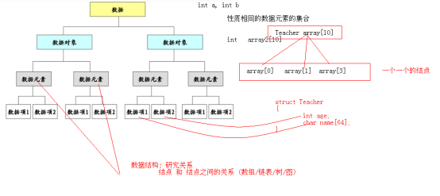

数据元素之间不是独立的，存在特定的关系，这些关系即结构

**数据结构指数据对象中数据元素之间的关系   **

如：数组中各个元素之间存在固定的线性关系   

- 编写一个“好”的程序之前，必须分析待处理问题中各个对象的特性，以及对象之间的关系。

基本概念总结：

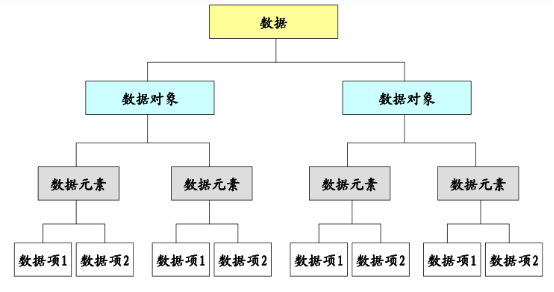

**数据的逻辑结构**

指数据元素之间的逻辑关系。即从逻辑关系上描述数据，它与数据的存储无关，是独立于计算机的。逻辑结构可细分为4类：

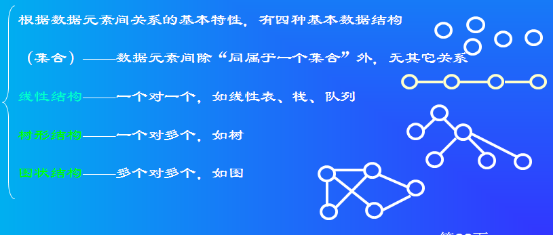

**数据的物理结构**

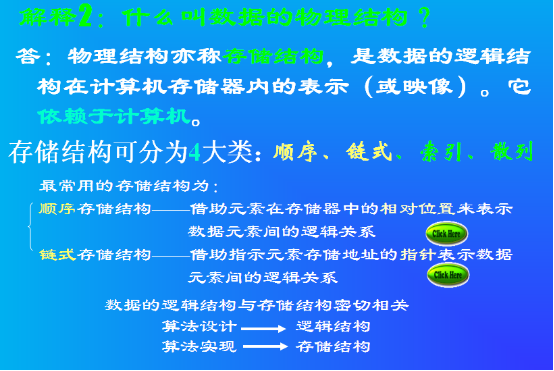

**数据的运算**

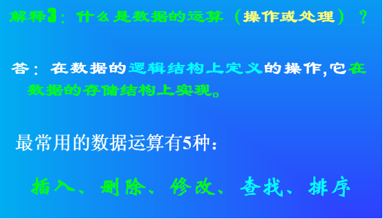

### 1.2 算法

**算法概念**

- 算法是**特定问题求解步骤的描述**

- 在计算机中表现为指令的有限序列 

- 算法是独立存在的一种解决问题的方法和思想。

- 对于算法而言，语言并不重要，重要的是思想。

**算法和数据结构区别**

- 数据结构只是静态的描述了数据元素之间的关系

- 高效的程序需要在数据结构的基础上设计和选择算法

**程序 = 数据结构 + 算法**

总结：

- 算法是为了解决实际问题而设计的

- 数据结构是算法需要处理的问题载体

- 数据结构与算法相辅相成

**算法特性**

输入

- 算法具有0个或多个输入

输出

- 算法至少有1个或多个输出

有穷性

- 算法在有限的步骤之后会自动结束而不会无限循环

确定性

- 算法中的每一步都有确定的含义，不会出现二义性

可行性

- 算法的每一步都是可行的

**算法效率的度量**

1、事后统计法

- 比较不同算法对同一组输入数据的运行处理时间
- 缺陷    
  - 为了获得不同算法的运行时间必须编写相应程序
  - 运行时间严重依赖硬件以及运行时的环境因素
  - 算法的测试数据的选取相当困难
- 事后统计法虽然直观，但是实施困难且缺陷多

算法效率的度量

- 事前分析估算
- 依据统计的方法对算法效率进行估算
- 影响算法效率的主要因素
  - 算法采用的策略和方法
  - 问题的输入规模
  - 编译器所产生的代码
  - 计算机执行速度

```c
//算法最终编译成具体的计算机指令
//每一个指令，在具体的计算机上运行速度固定
//通过具体的n的步骤，就可以推导出算法的复杂度
long sum1(int n){
    long ret = 0;                         
    int* array = (int*)malloc(n * sizeof(int)); 
    int i = 0;  
    
    for(i=0; i<n; i++)   
        array[i] = i + 1;
    
    for(i=0; i<n; i++) 
        ret += array[i];
    
    free(array); 
    return ret; 
}

long sum2(int n){
    long ret = 0;
    int i = 0;
    
    for(i=1; i<=n; i++)
		ret += i;
 
    return ret;
}

long sum3(int n){
    long ret = 0;  
    if( n > 0 )
        ret = (1 + n) * n / 2; 
    
    return ret;
}

int main(){
    printf("%d\n", sum1(100));
    printf("%d\n", sum2(100));
    printf("%d\n", sum3(100));
    
    return 0;
}

int func(int a[], int len){
    int i = 0;
    int j = 0;
    int s = 0;
    
    for(i=0; i<len; i++){
        for(j=0; j<len; j++){
            s += i*j;  //n*n
        }
    }
    return s; 
}
```

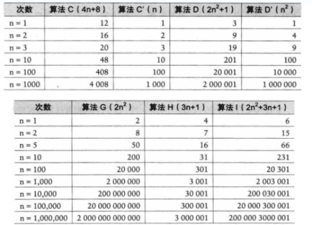

**注意 1**：判断一个算法的效率时，往往只需要关注操作数量的最高次项，其它次要项和常数项可以忽略。

**注意 2**：在没有特殊说明时，我们所分析的算法的时间复杂度都是指最坏时间复杂度。

2、大 O 表示法

- 算法效率严重依赖于操作(Operation)数量

- 在判断时首先关注操作数量的最高次项

- 操作数量的估算可以作为时间复杂度的估算

```c
O(5) = O(1)
O(2n + 1) = O(2n) = O(n)  
O(n2+ n + 1) = O(n2)
O(3n3+1) = O(3n3) = O(n3)
```

常见时间复杂度

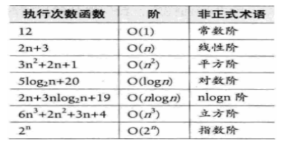

关系

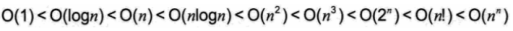

3、算法的空间复杂度

算法的空间复杂度通过计算算法的存储空间实现

```c
S(n) = O(f(n))
```

其中，`n` 为问题规模，`f(n)` 为在问题规模为 `n` 时所占用存储空间的函数

大 O 表示法同样适用于算法的空间复杂度

**当算法执行时所需要的空间是常数时，空间复杂度为O(1)**

空间与时间的策略：

- 多数情况下，算法执行时所用的时间更令人关注

- 如果有必要，可以通过增加空间复杂度来降低时间复杂度

- 同理，也可以通过增加时间复杂度来降低空间复杂度

练习1：分析 sum1 sum2 sum3 函数的空间复杂度

```c
O(4n+12)  O(8)=O(1)  O(4)=O(1)
```

总结：实现算法时，需要分析具体问题，对执行时间和空间的要求。

练习2：时间换空间

```c
/*
    问题： 
    在一个由自然数 1-1000 中某些数字所组成的数组中，每个数字可能出现零次或者多次。
    设计一个算法，找出出现次数最多的数字。
*/
方法1：
   排序，然后找出出现次数最多的数字

方法2：
void search(int a[], int len){
    int sp[1000] = {0};
    int i = 0;
    int max = 0;
    
    for(i=0; i<len; i++){
        int index = a[i] - 1;    
        sp[index]++;
    }
    
    for(i=0; i<1000; i++){
        if( max < sp[i] )
            max = sp[i];
    }
    
    for(i=0; i<1000; i++){
        if( max == sp[i] )
            printf("%d\n", i+1);
    }
}

int main(){
    int array[] = {1, 1, 3, 4, 5, 6, 6, 6, 2, 3};  
    search(array, sizeof(array)/sizeof(*array));   
    return 0;
}
```

把每个数字出现的次数的中间结果，缓存下来；在缓存的结果中求最大值。

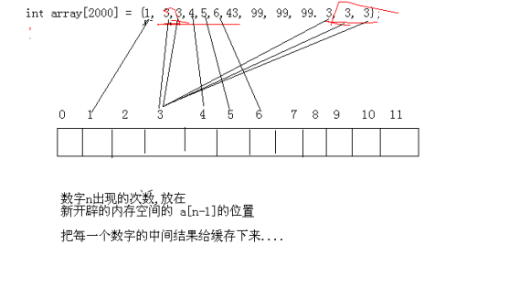

## 二、线性表

### 2.1 线性表基本概念

**线性表定义**

- 线性表(List)是零个或多个数据元素的集合 

- 线性表中的数据元素之间是有顺序的

- 线性表中的数据元素个数是有限的

- 线性表中的数据元素的类型必须相同

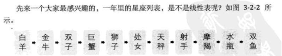

**数学定义**

线性表是具有相同类型的 n（ ≥ 0）个数据元素的有限序列

```c
（a1, a2, …, an）
ai 是表项，n 是表长度。
```

**性质**

- a0 为线性表的第一个元素，只有一个后继

- an 为线性表的最后一个元素，只有一个前驱

- 除 a0 和 an 外的其它元素 ai，既有前驱，又有后继
- 线性表能够逐项访问和顺序存取

**练习**

下面的关系中可以用线性表描述的是

- A.班级中同学的友谊关系 N:N

- B.公司中的上下级关系  1:N

- C.冬天图书馆排队占座关系 

- D.花名册上名字之间的关系 1::1

**线性表的操作**

- 创建线性表

- 销毁线性表

- 清空线性表

- 将元素插入线性表

- 将元素从线性表中删除

- 获取线性表中某个位置的元素

- 获取线性表的长度

> 线性表在程序中表现为一种特殊的数据类型
>
> 线性表的操作在程序中的表现为一组函数

```c
/*
	C 语言描述=====》线性表的设计与实现
	ADT 抽象层  《[数据结构(C语言版)].严蔚敏_吴伟民.扫描版.pdf》 p44页 
*/
#ifndef _WBM_LIST_H_
#define _WBM_LIST_H_

typedef void List;
typedef void ListNode;

//创建并且返回一个空的线性表
List* List_Create();
//销毁一个线性表list
void List_Destroy(List* list);
//将一个线性表list中的所有元素清空, 线性表回到创建时的初始状态
void List_Clear(List* list);
//返回一个线性表list中的所有元素个数
int List_Length(List* list);
//向一个线性表list的pos位置处插入新元素node
int List_Insert(List* list, ListNode* node, int pos);  
//获取一个线性表list的pos位置处的元素
ListNode* List_Get(List* list, int pos);
//删除一个线性表list的pos位置处的元素  返回值为被删除的元素，NULL表示删除失败
ListNode* List_Delete(List* list, int pos);

#endif

/* 注意: */
int List_Insert(List* list, ListNode* node, int pos);  (重点:分离思想) 
```

### 2.2 线性表的顺序存储结构

**基本概念**

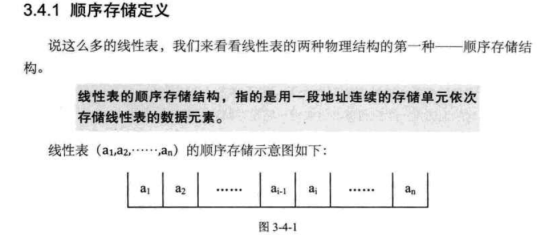

**设计与实现**

插入元素算法

- 判断线性表是否合法

- 判断插入位置是否合法

- 把最后一个元素到插入位置的元素后移一个位置

- 将新元素插入

- 线性表长度加 1

获取元素操作

- 判断线性表是否合法

- 判断位置是否合法

- 直接通过数组下标的方式获取元素

删除元素算法

- 判断线性表是否合法

- 判断删除位置是否合法

- 将元素取出

- 将删除位置后的元素分别向前移动一个位置

- 线性表长度减 1

链表顺序存储插入算法和删除算法

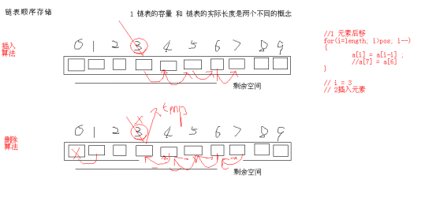

**优点和缺点**

优点：

- 无需为线性表中的逻辑关系增加额外的空间

- 可以快速的获取表中合法位置的元素

缺点：

- 插入和删除操作需要移动大量元素

- 当线性表长度变化较大时难以确定存储空间的容量

### 2.3 线性表的链式存储

**基本概念**

链式存储定义

- 为了表示每个数据元素与其直接后继元素之间的逻辑关系，每个元素除了存储本身的信息外，还需要存储指示其直接后继的信息。

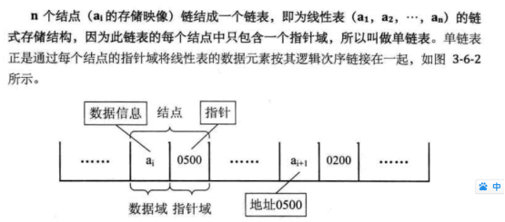

表头结点

- 链表中的第一个结点，包含指向第一个数据元素的指针以及链表自身的一些信息

数据结点

- 链表中代表数据元素的结点，包含指向下一个数据元素的指针和数据元素的信息

尾结点

- 链表中的最后一个数据结点，其下一元素指针为空，表示无后继。

**链表技术领域推演**

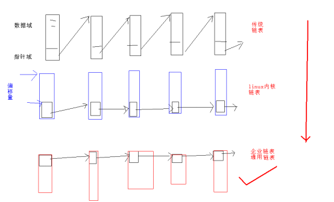

**设计与实现**

链表链式存储 `_api` 实现分析

在C语言中可以用结构体来定义链表中的指针域

链表中的表头结点也可以用结构体实现

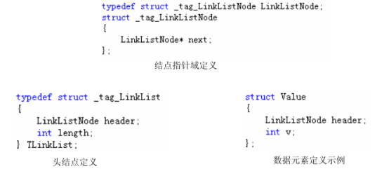

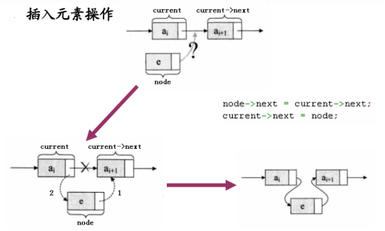

```c
// 带头结点、位置从0的单链表
// 返回链表中第3个位置处，元素的值
LinkListNode* LinkList_Get(LinkList* list, int pos){ 
	int  i = 0;
	TLinkList *tList = (TLinkList *)list;
	LinkListNode *current = NULL;
	LinkListNode *ret = NULL;

	if (list == NULL || pos < 0 || pos >= tList->length)
		return NULL;

	current = (LinkListNode *)tList;
	for (i=0; i<pos; i++)
		current = current->next;

	ret = current->next;
	return ret ;
}
/*
  
*/
```

返回第三个位置的,移动pos次以后，当前指针指向哪里？

答案：指向位置2，所以需要返回 `ret = current->next;`

```c
/*
    备注：循环遍历时，	
    	遍历第1次，指向位置0
        遍历第2次，指向位置1
        遍历第3次，指向位置2
        遍历第n次，指向位置n-1;
*/
```

所以如果想返回位置 n 的元素的值，需要怎么做 `ret = current->next;`

此问题是：**指向头结点的指针移动 n 次 和 第 n 个元素之间的关系？ **

删除元素

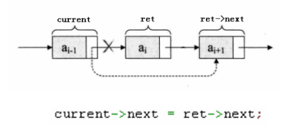

**优点和缺点**

优点：

- 无需一次性定制链表的容量 

- 插入和删除操作无需移动数据元素

缺点：

- 数据元素必须保存后继元素的位置信息

- 获取指定数据的元素操作需要顺序访问之前的元素

### 2.4 循环链表

**基本概念**

循环链表的定义：将单链表中最后一个数据元素的next指针指向第一个元素

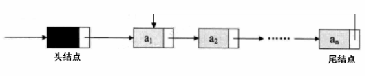

循环链表拥有单链表的所有操作

- 创建链表

- 销毁链表

- 获取链表长度

- 清空链表

- 获取第pos个元素操作

- 插入元素到位置pos

- 删除位置pos处的元素

新增功能：**游标** 的定义

在循环链表中可以定义一个“当前”指针，这个指针通常称为 **游标**，可以通过这个游标来遍历链表中的所有元素。

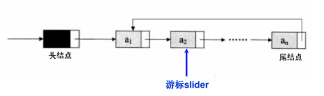

循环链表新操作

```c
// 将游标重置指向链表中的第一个数据元素
CircleListNode* CircleList_Reset(CircleList* list);

// 获取当前游标指向的数据元素
CircleListNode* CircleList_Current(CircleList* list);

// 将游标移动指向到链表中的下一个数据元素
CircleListNode* CircleList_Next(CircleList* list);

// 直接指定删除链表中的某个数据元素 
CircleListNode* CircleList_DeleteNode(CircleList* list, CircleListNode* node);  
// 根据元素的 值 删除, 元素 pk 根据元素的 位置 删除元素
```

**循环链表的应用**

**证明循环链表**

- 打印两次。

**约瑟夫问题求解**

> 约瑟夫问题 - 循环链表典型应用
>
> n 个人围成一个圆圈，首先第 1 个人从 1 开始一个人一个人顺时针报数，报到第 m 个人，令其出列。然后再从下一 个人开始从 1 顺时针报数，报到第 m 个人，再令其出列，…，如此下去，求出列顺序。

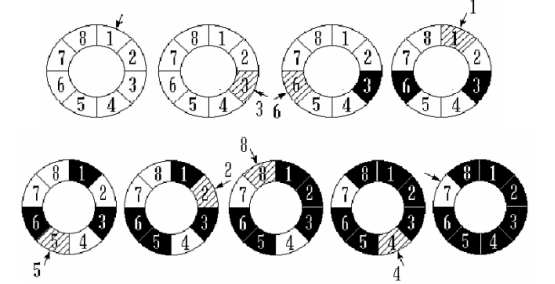

**设计与实现**

**循环链表插入元素的分析** 

1） 普通插入元素（和单链表是一样的）

2） 尾插法（和单链表是一样的，单链表的写法支持尾插法；因：辅助指针向后跳length次，指向最后面那个元素）

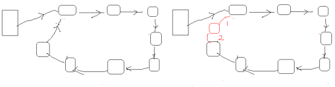

```c
void CircleList_Insert(list, (CircleListNode*)&v1, CircleList_Length(list));
```

3） 头插法（要进行头插法，需要求出尾结点，和单链表不一样的地方，保证是循环链表）第一次插入元素时，让游标指向 0 号结点

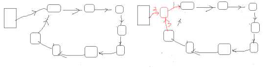

```c
void CircleList_Insert(list, (CircleListNode*)&v1, 0);
```

4）第一次插入元素

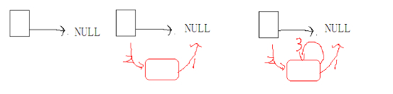

**循环链表插入综合场景分析图**

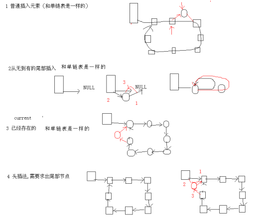

**循环链表删除结点分析**

1、 删除普通结点

2、 删除头结点（删除 0 号位置处元素），需要求出尾结点

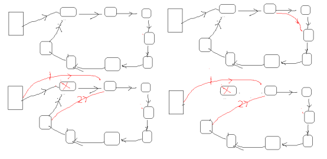

**优点和缺点**

优点：功能强了。

- 循环链表只是在单链表的基础上做了一个加强

- 循环链表可以完全取代单链表的使用

- 循环链表的 Next 和 Current 操作可以高效的遍历链表中的所有元素

缺点：

- 代码复杂度提高了

### 2.5 双向链表

**基本概念** 

请思考： 为什么 **需要** 双向链表？

- 单链表的结点都只有一个指向下一个结点的指针

- 单链表的数据元素无法直接访问其前驱元素

- **逆序访问单链表** 中的元素是极其 **耗时** 的操作！

```c
len = LinkList_Length(list);
for (i=len-1; len>=0; i++) //O(n)
{
    LinkListNode *p = LinkList_Get(list, i); //O(n)
    //访问数据元素p中的元素
    //
}
```

**双向链表的定义**

在单链表的结点中增加一个指向其前驱的 pre 指针

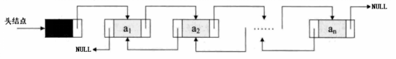

双向链表拥有单链表的所有操作

- 创建链表

- 销毁链表

- 获取链表长度

- 清空链表

- 获取第 pos 个元素操作

- 插入元素到位置 pos

- 删除位置 pos 处的元素

**设计与实现**

循环链表一般操作

>  插入操作

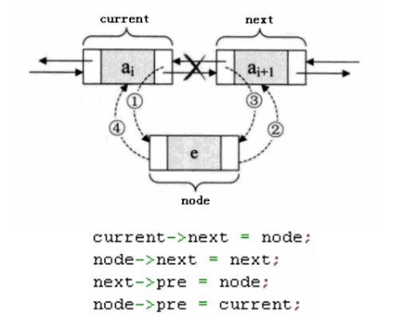

插入操作异常处理

- 插入第一个元素异常处理

- 在 0 号位置处插入元素；

> 删除操作

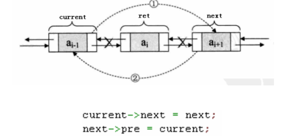

删除操作异常处理

双向链表的新操作

- 获取当前游标指向的数据元素

- 将游标重置指向链表中的第一个数据元素

- 将游标移动指向到链表中的下一个数据元素

- 将游标移动指向到链表中的上一个数据元素

- 直接指定删除链表中的某个数据元素

```c
DLinkListNode* DLinkList_DeleteNode(DLinkList* list, DLinkListNode* node);
DLinkListNode* DLinkList_Reset(DLinkList* list);
DLinkListNode* DLinkList_Current(DLinkList* list);
DLinkListNode* DLinkList_Next(DLinkList* list);
DLinkListNode* DLinkList_Pre(DLinkList* list);
//大家一定要注意：教科书不会告诉你 项目上如何用；哪些点是项目的重点；做一个企业级的财富库，完成你人生开发经验的积累，是我们的学习重点，要注意！
```

**优点和缺点**

优点：

- 双向链表在单链表的基础上增加了指向前驱的指针

- 功能上双向链表可以完全取代单链表的使用

- 双向链表的 Next，Pre 和 Current 操作可以高效的遍历链表中的所有元素

缺点：

- 代码复杂

## 三、栈 tack 和队列 queue

### 3.1栈 stack

**Stack基本概念**

- 栈是一种  特殊的线性表  

- 栈仅能在线性表的一端进行操作
  - 栈顶(Top)：允许操作的一端
  - 栈底(Bottom)：不允许操作的一端

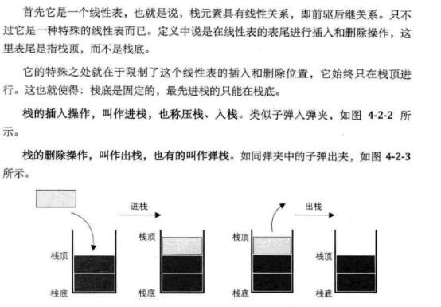

**Stack的常用操作**

- 创建栈

- 销毁栈

- 清空栈

- 进栈

- 出栈

- 获取栈顶元素

- 获取栈的大小 

```c
#ifndef _MY_STACK_H_
#define _MY_STACK_H_

typedef void Stack;

Stack* Stack_Create();

void Stack_Destroy(Stack* stack);

void Stack_Clear(Stack* stack);

int Stack_Push(Stack* stack, void* item);

void* Stack_Pop(Stack* stack);

void* Stack_Top(Stack* stack);

int Stack_Size(Stack* stack);

#endif //_MY_STACK_H_
```

**栈模型和链表模型关系分析**

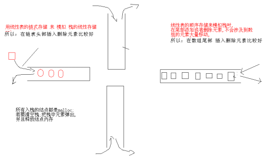


