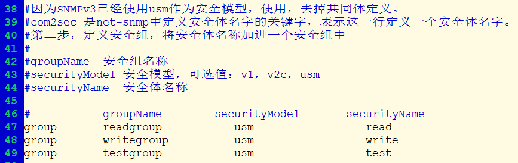

# SNMP 配置详解

## 1. NET-SNMP 简介

> [浅谈 Linux 系统中的 SNMP Trap](https://www.ibm.com/developerworks/cn/linux/l-cn-snmp/index.html)

在 Linux 系统中，我们可以选择 net-snmp 来处理绝大多数和 SNMP 相关的工作。

NET-SNMP 是一种开放源代码的 SNMP 协议实现。它支持 SNMP v1, SNMP v2c 与 SNMP v3，并可以使用 IPV4 及 IPV6 。也包含 SNMP Trap 的所有相关实现。Net-snmp 包含了 snmp 实用程序集和完整的 snmp 开发库。

用户使用 net-snmp 提供的工具，可以完成很多关于 SNMP 的操作，具体说来，包括以下一些命令行应用程序：

1. 一些应用程序可以用来从支持 SNMP 的设备获得数据。其中 `snmpget`  可以支持独立请求，比如：

   ```shell
   root@CELL:/# snmpget -v 1 -c demopublic test.net-snmp.org system.sysUpTime.0
   DISMAN-EVENT-MIB::sysUpTimeInstance = Timeticks: (149359961) 17 days, 6:53:19.61
   ```

   该命令获得单个独立的 MIB 对象 system.sysUpTime.0 的值。

2. 而 `snmpwalk` 则用来支持重复请求。

   ```shell
   root@CELL:/# snmpwalk -v 2c -c demopublic test.net-snmp.org system 
   SNMPv2-MIB::sysDescr.0 = STRING: test.net-snmp.org
   SNMPv2-MIB::sysObjectID.0 = OID: NET-SNMP-MIB::netSnmpAgentOIDs.10
   DISMAN-EVENT-MIB::sysUpTimeInstance = Timeticks: (149367810) 17 days, 6:54:38.10
   SNMPv2-MIB::sysContact.0 = STRING: Net-SNMP Coders <net-snmp-coders@lists.sourceforge.net>
   SNMPv2-MIB::sysName.0 = STRING: test.net-snmp.org
   SNMPv2-MIB::sysLocation.0 = STRING: Undisclosed
   SNMPv2-MIB::sysORLastChange.0 = Timeticks: (2) 0:00:00.02
   SNMPv2-MIB::sysORID.1 = OID: SNMPv2-MIB::snmpMIB
   SNMPv2-MIB::sysORID.2 = OID: SNMP-VIEW-BASED-ACM-MIB::vacmBasicGroup
   SNMPv2-MIB::sysORID.3 = OID: SNMP-MPD-MIB::snmpMPDCompliance
   SNMPv2-MIB::sysORID.4 = OID: SNMP-USER-BASED-SM-MIB::usmMIBCompliance
   SNMPv2-MIB::sysORID.5 = OID: SNMP-FRAMEWORK-MIB::snmpFrameworkMIBCompliance
   SNMPv2-MIB::sysORDescr.1 = STRING: The MIB module for SNMPv2 entities
   SNMPv2-MIB::sysORDescr.2 = STRING: View-based Access Control Model for SNMP.
   SNMPv2-MIB::sysORDescr.3 = STRING: The MIB for Message Processing and Dispatching.
   SNMPv2-MIB::sysORDescr.4 = STRING: The management information definitions for the SNMP User-based Security Model.
   SNMPv2-MIB::sysORDescr.5 = STRING: The SNMP Management Architecture MIB.
   SNMPv2-MIB::sysORUpTime.1 = Timeticks: (2) 0:00:00.02
   SNMPv2-MIB::sysORUpTime.2 = Timeticks: (2) 0:00:00.02
   SNMPv2-MIB::sysORUpTime.3 = Timeticks: (2) 0:00:00.02
   SNMPv2-MIB::sysORUpTime.4 = Timeticks: (2) 0:00:00.02
   SNMPv2-MIB::sysORUpTime.5 = Timeticks: (2) 0:00:00.02
   ```

   上面的命令返回所有 system 节点以下的 MIB 对象的值。

3. 命令 `snmpset` 对支持 SNMP 的设备配置属性。如下例所示：

   ```shell
   root@CELL:/# snmpget -v 1 -c demopublic test.net-snmp.org ucdDemoPublicString.0 
    UCD-DEMO-MIB::ucdDemoPublicString.0 = "hi there!"
   root@CELL:/# snmpset -v 1 -c demopublic test.net-snmp.org ucdDemoPublicString.0 s "Hello, world!"
    UCD-DEMO-MIB::ucdDemoPublicString.0 = "Hello, world!"
   root@CELL:/# snmpget -v 1 -c demopublic test.net-snmp.org ucdDemoPublicString.0 
    UCD-DEMO-MIB::ucdDemoPublicString.0 = "Hello, world!"
   ```

4. 命令 `snmpstatus` 可以从支持 SNMP 的设备获取特定的信息。比如下面的命令从目标系统上获得类似 netstat 的信息：

   ```shell
   root@CELL:/# snmpnetstat -v 2c -c public -a testhost 
    
   Active Internet (tcp) Connections (including servers) 
   Proto Local Address Foreign Address           (state) 
   tcp   *.echo         *.*                      LISTEN 
   tcp   *.discard      *.*                      LISTEN 
   tcp   *.daytime      *.*                      LISTEN 
   tcp   *.chargen      *.*                      LISTEN 
   tcp   *.ftp          *.*                      LISTEN 
   tcp   *.telnet       *.*                      LISTEN 
   tcp   *.smtp         *.*                      LISTEN 
   Active Internet (udp) Connections 
   Proto Local Address 
   udp    *.echo 
   udp    *.discard 
   udp    *.daytime 
   udp    *.chargen 
   udp    *.time
   ```

Net-snmp 还提供了接收 SNMP traps 的守护程序 snmptrapd。可以将选定的 SNMP 消息记录到系统日志 syslog,NT 事件日志，或者文本文件中。或是转发到其它的 SNMP 管理程序 , 也可以传给外部的应用程序。本文的后面我们将用它来演示 SNMP Trap 的收发。

Net-snmp 还提供了一个回应 SNMP 查询的客户端 snmpd. 它集成了大量 SNMP 的模块 . 并可通过动态链接库 , 外部脚本与命令 , 多路 SNMP 技术 (SMUX), 以及可扩客户端协议 (AgentX) 进行扩展 .

此外，net-snmp 还包含了用来开发 SNMP 应用程序的程序库。支持 C 与 perl 的 APIs。因此您可以使用 net-snmp 的工具集完成一些关于 SNMP 的工作，也可以依赖 net-snmp 提供的开发包自己写程序开发您所需要的 snmp 应用。

## 2. net-snmp 配置文件详解

> [net-snmp配置文件详解](http://www.cnblogs.com/oloroso/p/4844907.html)

net-snmp 的配置文件是有一定的层次结构的，配置起来也很方便。网上找了很多资料，大概把这个配置文件的各个信息搞懂了一点。其实在 net-snmp 的 EXAMPLE.conf 文件中对齐有详细的描述，不过是英文的。

### 2.1 开启子代理模式

开发 net-snmp 子代理后，如果想要使用它，必须开启子代理功能。如果不开启，子代理运行的时候将会报错 

```shell
Warning: Failed to connect to the agentx master agent ([NIL]) 
```

### 2.2 设置 snmpd 监听的地址端口

snmpd 默认是监听本地所有的IP地址的 UDP 161端口 等待 snmp 请求。如果不希望使用默认的监听设置，可以使用自定义的选项

```shell
#  Listen for connections from the local system only
# 只监听本地的连接
agentAddress  udp:127.0.0.1:161

#  Listen for connections on all interfaces (both IPv4 *and* IPv6)
# 监听所有接口的连接
#agentAddress udp:161,udp6:[::1]:161
```

### 2.3 定义安全体名和共同体名称

共同体这个是 SNMPv2 中的，如果只是使用 SNMPv3 协议，可以不需要。

```shell
rocommunity    #共同体名
rwcommunity    #共同体名
```

- 使用 rocommunity 来定义一个只读权限的共同体
- 使用 rwcommunity 来定义一个读写权限的共同体。

定义完共同体之后就要定义一个安全体，并把共同体映射到一个安全体中去。安全体用于控制外部访问的来源的。

使用 com2sec 关键字来定义安全体。

```shell
#            sec.name        souce            community
com2sec        read            default                public
com2sec        write            default                public
com2sec        test            default                public
```

```
1. com2sec
命令格式一：com2sec   [-Cn context]   sec.name   source   community
功能： map an SNMPv1 or SNMPv2c community string to a security name，即将实体(community)字符串映射为安全的
名字：v1 和 v2 版本都是明文密码，也就无所谓安全性了。v3 中增加了安全性。
参数说明：-Cn context：可选的，在v3版本中使用
    sec.name： 内部映射的名字，字符串，后面用到
    community：实体字符串，外部使用的名字
    source：可以访问的ip地址范围，默认值"default”，即任何ip都可以访问。
    也可以限制ip范围，有两种方式：IP/MASK和IP/BITS
        IP/MASK：10.10.10.0/255.255.255.0
        IP/BITS ：10.10.10.0/24：只有ip地址在10.10.10.0
        mask为24个1，即255.255.255.0
命令格式二：com2sec6  [-Cn context] sec.name source community
    针对ipv6，其他和com2sec相同
命令格式三：com2secunix [-Cn context] sec.name sockpath community
    只限本地socket可以访问
------------------------------------------------------------------------
因为 SNMPv3 已经使用 usm 作为安全模型，使用，去掉共同体定义。
com2sec 是 net-snmp 中定义安全体名字的关键字，表示这一行定义一个安全体名字。
```


### 2.4 定义安全组

定义完安全体之后，就要定义安全组了。

- 安全体是用于控制访问的的来源的

- 安全组就是控制安全体中允许的来源的访问授权模式的

```
com2sec 是 net-snmp 中定义安全体名字的关键字，表示这一行定义一个安全体名字。
第二步，定义安全组，将安全体名称加进一个安全组中

groupName  安全组名称
securityModel 安全模型，可选值：v1，v2c，usm
securityName  安全体名称

#            groupName         securityModel         securityName
group        readgroup            usm                    read
group        writegroup            usm                    write
group        testgroup            usm                    test

group 是定义安全组的关键字
2. group
命令格式：group   groupName   securityModel   sec.name
功能：将 sec.name 映射到一个 group 中，组中具有相同的存取权限。组中至少有两个
    sec.name，如果只有一个 sec.name，也会被解释为两个。即有两个相同的
参数说明：groupName：组名
           securityModel：v1、v2c、usm、tsm、ksm 其一
```



### 2.5 定义视图，供安全组使用

定义完安全组后，需要定义一个视图。

- 视图就是这个安全体的可见范围。

对于每一个安全体，需要向其授权一些视图，**视图确定了可以访问那些节点**。

```
第三步，定义视图，供安全组使用
view.name  视图名
incl/excl  对下面的 MIB 子树是包括还是排除(included/excluded)
subtree    视图中所涉及的 mib 子树
mask(optional)  掩码
#        view.name    incl/excl       subtree                   [mask]
view    all            included        .1      
view    test           included        system      
view    test           included        system.sysLocation      
#view    if2            included        .1.3.6.1.2.1.2.2.1.0.2   FFA0

此处定义的就是 VACM 中的视图子树和掩码，配置将出现在 VACM 相关表中。
此处对网络接口 2 定义了一个视图，将来作为一个独立的 context,mask 参见 VACM。
view 是定义视图的关键字

3. view
命令格式：view viewName type oid[mask]
功能：定义一个view，表示整个OID树的子树，同一个子树可以定义多个view
参数说明:    viewName：view名字
           type：有两个值:include 和 exclude
           oid：可以访问的oid
           [mask]：对oid的mask
               例如：view all include 1.3.6.1.2.1.4  0xf0
               0xf0：1111 0000，即访问的oid的前4位必须是1.3.6.1，否则不能访问，即
               可以访问1.3.6.1下所有的子oid
```


### 2.6 向安全组授权相应的视图

```
第四步，向安全组授权相应的视图
group 安全组名
context 上下文 v1，v2 中始终为空
sec.model 安全模型，可选值：v1，v2，usm
sec.level 安全级别  可选值：auth,noauth,priv,     v1,v2c中只能为 noauth
prefix 前缀。指定 context 如何与 PDU 中的 context 匹配，V3 使用
read   授权的读视图
write  授权的写视图
notif  授权的 trap 视图

#       group    context        sec.model    sec.level    prefix    read   write   notif
access  readgroup    ""            any        noauth        exact     all    none    none
access  writegroup    ""            any        noauth        exact     all    none    none
access  testgroup    ""            any        noauth        exact     all    none    none
#acess  readgroup "interface2"    usm        priv        exact     if2    if2        if2  

4. access
命令格式：access groupName context model level prefx read write notify
功能：设置访问某一个 view 的存取权限
参数说明:    groupName：控制存取权限的组名
            context：v1 和 v2c 版本，context 必须设置为 ""
            model：v1、v2c、usm、tsm、ksm
            最后 3 中是 v3 版本的授权模式，usm（User-Based Security Model）是默认授权模式，tsm 用于 SSH or DTLS，ksm 用于支持 Kerberos
            level：可以去 3 种值：noauth、auth、priv
            	noauth：允许无权限访问（v1，v2c使用）
            	auth：必须有权限才能访问
            	priv：强制加密访问
            prefx：exact or prefix
            read、write、notify：指明某一个 view 的权限是否可以 `GET*`, `SET*`、
            `TRAP/INFORM`，如果该 view 不能 read，则置none  
```


### 2.7 添加用户（仅限 SNMPv3）

SNMPv3 使用了用户加密鉴权的认证方式，所以需要创建相关的用户。这里也可以用 net-snmp-config –create-snmpv3-user 来实现。

创建用户使用 createUser 关键字来进行。后面的参数依次是用户名、验证方式、验证码、加密方式、加密码

创建的用户需要指明用户的权限，使用关键字 rouser 和 rwuser 来操作。

- rouser 用于指定用户的权限为只读，如果后面加上 priv 来指明需要加密。可以使用 auth 来指明需要认证。

- rwuser 用于指定用户的权限为读写，其他的与上面一致。

```
第五步，添加用户
#           user    验证方式        验证码       加密方式        加密码
createUser  fx        MD5        "md5123456"    DES        "des123456"
createUser  fxr       MD5        "md5123456"
#用户的权限设置
rwuser　　　　fx　　priv　　#读写用户，用户名fx，指明需要加密
rouser　　　　fxr　　　　　　#只读用户

    #rouser [-s SECMODEL] USER [noauth|auth|priv [OID | -V VIEW [CONTEXT]]]
    #rwuser [-s SECMODEL] USER [noauth|auth|priv [OID | -V VIEW [CONTEXT]]]
```


### 2.8 SNMP Trap发送目的地设置

以上都是对 SNMP 代理程序的外部请求的相关设置。SNMP 代理还有一个重要的功能就是主动向网管端发送 “通知”。

对此需要指定网关端的目的地址。

使用 snmpsink 来指定发送 SNMPv1 版本的 Trap 的目的地址和共同体名称

使用 snmp2sink 来指定发送 SNMPv2 版本的 Trap 的目的地址和共同体名称

使用 informasink 来指定发送 INFORMs 的目的地址和共同体名称

使用 trappsess 来指定发送 SNMPv3 版本的 Trap 的相关信息。其中引擎 ID 和用户名，验证方式，验证码等都必须和接收 trap 的网关软件端设置的一致。

```shell
#   发送 SNMPv1  traps
trapsink     localhost public
#   发送 SNMPv2c traps
trap2sink    localhost public
#   发送 SNMPv2c INFORMs
informsink   localhost public
#   发送SNMPv3 traps
#trapsess -v 2 -u 用户名  -e  引擎ID       -a 验证方式 -A 验证码  -l  鉴权方式   目的IP
trapsess -v 3 -u myuser -e 0x010203040506 -a MD5 -A 111111111 -l authNoPriv 192.168.1.108
```

