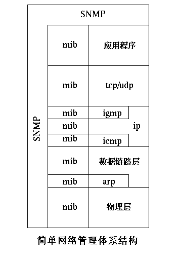

# SNMP 结构

## 1. 体系结构

- 所有在应用层下的 TCP/IP 层都有它自己的 SNMP 结构
- 硬件制造商可以在它的产品中实现了相应的管理结构
- 从图上可以看到有许多 MIB，但服务器只有一台

## 2. 服务器处理过程

- 基站发送的请求仅有两种类型，取值和赋值
- 一个请求可以进行多个操作

## 3. ASN.1

- ASN.1是用于定义MIB对象的高层计算机语言
- SNMP使用ASN.1子集的基本类型：整数，字符串，对象标识符，序列和空值
- BER用于将ASN.1编译为SNMP可以传送的字符串，在SNMP代理间传送。对于变量ASN.1使用词典顺序进行有序排列，并定义了层次状态的名字空间
- 词典式排序可以使服务器不需要知道被请求的变量的大小而直接响应请求。
- 所有的变量都有后后缀`iso.org.dod.internet.mgmt.mib`或`1.3.6.1.2.1`

## 4. PDU

- 客户可以发送以下三个基本命令：`设置，读取和取下一个`
- 设置和读取指令使服务器进行直接变量映射
- 取下一个指令指定要取的变量名，服务器根据变量当前所排的字典序返回指定变量名下一个变量的值，在不知道表大小的时候这条指令十分有用
- 在层次的树状结构中可以一定前进一个结点，当然这样会因为要多次发送请求和相应于请求的数据而对网络造成不必要的压力，也可以在树状结构中一次取得多个点的数据
- 如果发生意外情况，客户会向服务器的162端口发送一个消息，告知服务器指定的变量值发生了变化。通常由服务器请求而获得的数据由服务器的161端口接收。

## 5. Hash表设计

- Hash表用于快速查找变量，Hash表是一个指针数组，每个数组指向一组具有相同Hash值的结点。
- 如果需要查找MIB变量的值，服务器根据变量名的数字表示经过Hash函数计算后得到数组索引值，通过查找数组相应元素指向的结点可以找到需要的数据
- 而在MIB中的每个元素除了使用字典序进行排序之外，还拥有一个指向下一个元素的指针，这个指针在执行取下一个指令时特别有用，在其中还包括了ASN.1名称，和能够作于此变量的所有函数的地址以及内部变量地址
- 在服务器启动时初始化这些变量的值

## 6. SNMP总结

SNMP 是一种易于实现的基本的网络管理工具，它能够满足短期的管理要求。因为基于 OSI 的管理协议现在进展缓慢，所以它起到了一个重要的补充作用。

SNMP 协议提供了用于定义网络信息和框架和用于交换信息的协议标准。SNMP 模型引入了管理器和代理的概念，管理器指的是以人类管理员身份负责所有网络（或部分网络）的软件。代理指的被管理设备中的软件，它用以完成管理器所需要进行的局部管理和应急通知管理器的功能。

## Reference

### net-snmp子代理(SubAgent)编写

> [net-snmp子代理(SubAgent)编写](https://www.cnblogs.com/oloroso/p/4708581.html)

### SNMP报文抓取与分析

> [SNMP报文抓取与分析(一)](https://www.cnblogs.com/oloroso/p/4671184.html)
>
> [SNMP报文抓取与分析(二)](https://www.cnblogs.com/oloroso/p/4682502.html)

### net-snmp的MIBs扩展

> [net-snmp的MIBs扩展](https://www.cnblogs.com/oloroso/p/4599501.html)

### 关于SNMP的MIB文件的语法简述

> [关于SNMP的MIB文件的语法简述](https://blog.csdn.net/shanzhizi/article/details/15340305)
>
> [MIB结构和语法](https://wenku.baidu.com/view/3b725c391711cc7931b716a1.html)
>
> [Net-snmp总结(四)-net-snmp的MIBs扩展_添加set](https://blog.csdn.net/JIANGXIN04211/article/details/78477890)

### 华为 -- MIB简介

> [MIB简介](http://support.huawei.com/enterprise/docinforeader!loadDocument1.action?contentId=DOC1000097258&partNo=10042)

### SNMP 协议介绍

> [SNMP协议详解](https://blog.csdn.net/shanzhizi/article/details/11606767)
>
> [网络协议篇之SNMP协议（一）——SNMP报文协议](https://blog.csdn.net/zqixiao_09/article/details/77126897)
>
> [基于Net-SNMP简单网络管理的开发指南](http://chichangjing.github.io/2016/02/03/net-snmp-develop.html)
>
> [Net-snmp总结(六)-net-snmp源码分析](https://blog.csdn.net/JIANGXIN04211/article/details/78478581)
>
> [net-snmp学习总结](https://blog.csdn.net/jiangxin04211/article/category/7269194)
>
> [SNMP 原理与实战详解](http://blog.51cto.com/freeloda/1306743)

