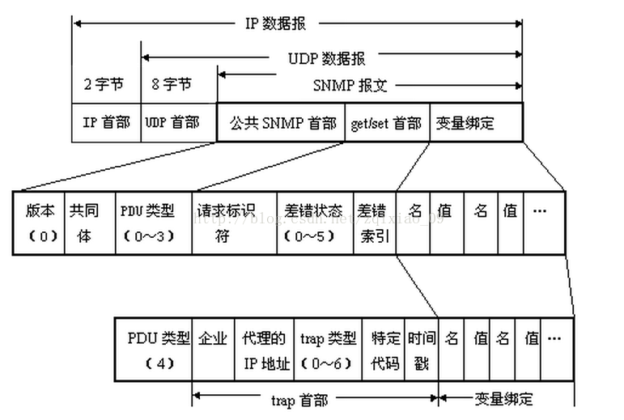
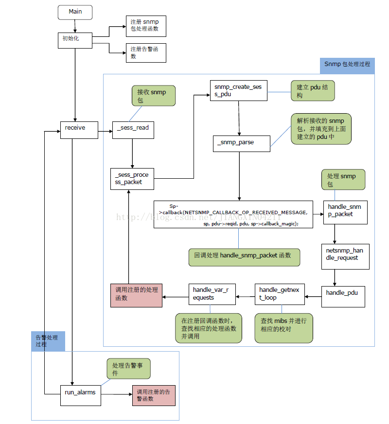

# Net-SNMP Mibs扩展

> [Net-snmp总结(六)-net-snmp源码分析](https://blog.csdn.net/JIANGXIN04211/article/details/78478581)
>
> [快速理解和掌握MIB](https://blog.csdn.net/zhigang0529/article/details/83182011)
>
> [net-snmp的MIBs扩展](https://www.cnblogs.com/oloroso/p/4599501.html)
>
> [Net-snmp总结(三)-net-snmp的MIBs扩展_添加get](https://blog.csdn.net/JIANGXIN04211/article/details/78475155)
>
> [基于Net-SNMP简单网络管理的开发指南](http://chichangjing.github.io/2016/02/03/net-snmp-develop.html)
>
> [net-snmp agent开发（用net-snmp扩展MIB库）](http://www.codexiu.cn/linux/blog/21346/)
>
> [snmp的使用](https://blog.csdn.net/q_l_s/article/details/51721572)
>
> [烂泥：使用snmpwalk采集设备的OID信息](https://www.ilanni.com/?p=8408)
>
> [浅谈 Linux 系统中的 SNMP Trap](https://www.ibm.com/developerworks/cn/linux/l-cn-snmp/index.html)
>
> [用net-snmp开发snmp代理客户端](http://www.voidcn.com/article/p-ovlmmgko-bdh.html)
>
> [用NET-SNMP软件包开发简单客户端代理（上）](http://blog.51cto.com/mandyc/579828)
>
> [用NET-SNMP软件包开发简单客户端代理](https://wenku.baidu.com/view/de51c35077232f60ddcca13f.html)
>
> [SmithSNMP v0.8发布，Lua 轻松定制MIB的SNMP代理](https://www.ctolib.com/topics-107371.html)
>
> [总结：用net-snmp开发snmp代理客户端](https://www.smwenku.com/a/5b902f9b2b7177672217d3b3/zh-cn/)
>
> ### 百度文库
>
> > [SNMP网管协议培训教材](https://wenku.baidu.com/view/7a4e2abdf121dd36a32d8268.html?sxts=1541400068018)
> >
> > [SNMP学习小结](https://wenku.baidu.com/view/1cedbd225901020207409c2a.html?sxts=1541400066280)
> >
> > [简单网络管理协议SNMP](https://wenku.baidu.com/view/dfa1f18fa0116c175f0e4878.html?sxts=1541400069975)
> >
> > [SNMPv1 , SNMPv2 ,SNMPv3 ,RMON网络管理](https://wenku.baidu.com/view/89973f6daf1ffc4ffe47acb0.html?sxts=1541401176402)
> >
> > [SNMP协议基础](https://wenku.baidu.com/view/e65c9c8702d276a200292e70.html?sxts=1541401177761)
> >
> > [SNMP简单网络管理协议](https://wenku.baidu.com/view/35dddab265ce0508763213af.html?from=search)
> >
> > [net-snmp安装配置手册](https://wenku.baidu.com/view/cf0efc335a8102d276a22f6d.html?from=search)
> >
> > [SNMP V3](https://wenku.baidu.com/view/b75ef190aa00b52acfc7caec.html?from=search)
> >
> > [SNMP V3 分析及详解](https://wenku.baidu.com/view/6ecdca651ed9ad51f01df2fa.html?from=search)
> >
> > [SNMP+MIB完整手册](https://wenku.baidu.com/view/3cbbbdcb0508763231121214.html?from=search)
> >
> > [基于NETSNMP开发mib说明](https://wenku.baidu.com/view/c3ebe8c008a1284ac8504346.html?from=search)
>
> ### OID
>
> > [snmp oid](https://wenku.baidu.com/view/bb9f5c46524de518964b7dec.html?rec_flag=default&sxts=1541478085373)
> >
> > [snmp服务配置及其oid、mib文件解析](https://blog.csdn.net/wh8_2011/article/details/64921699)
> >
> > [SNMP、MIB、OID概念的理解](https://my.oschina.net/yjwxh/blog/476454)
> >
> > [常用的SNMP监控OID列表,包括Trap的解释](https://wenku.baidu.com/view/b4ff48a2284ac850ad02423e.html?sxts=1541478057343)
> >
> > [SNMP协议分析](https://wenku.baidu.com/view/82652b75a417866fb84a8e4d.html?sxts=1541478066084)
> >
> > [SNMP协议基础](https://wenku.baidu.com/view/30450700b52acfc789ebc986.html?sxts=1541478067662)
> >
> > [SNMP MIB完整手册](http://network.51cto.com/art/201007/209214_all.htm)
> >
> > [StorageTek 模块化磁带库 SNMP 参考指南](https://docs.oracle.com/cd/E68530_01/SLESR/snmp_mib.htm#A1066148)
> >
> > [SNMP（MIB（OID）& SMI & SNMP）介绍，](http://www.voidcn.com/article/p-hheeiaeg-rn.html)
> >
> > [三分钟看懂Snmp协议分析](https://blog.csdn.net/CauseAndAffect/article/details/46897163)
> >
> > [网络协议篇之SNMP协议（一）——SNMP报文协议](https://blog.csdn.net/zqixiao_09/article/details/77126897)
> >
> > [网络协议：SNMP协议深入分析和学习笔记](http://velep.com/archives/422.html)

## 1. SNMP 协议分析

> [SNMPv2c Packet FormatSNMPv2c报文格式](http://www.023wg.com/message/message/cd_feature_snmpv2c_message.html)

关键点：BER 编码

### 1.1 协议字段



### 1.2 PDU 类型对应编号

| **PDU类型** | **名称**             |
| ----------- | -------------------- |
| **0**       | **get-request**      |
| **1**       | **get-next-request** |
| **2**       | **get-response**     |
| **3**       | **set-request**      |
| **4**       | **trap**             |

### 1.3 BER 编码

BER 的数据都由三个域构成：

- 标识域(tag) + 长度域(length) + 值域(value)。

### 1.4 常见问题解答

#### 1.4.1 常见的类型(标识域)有哪些及其对应的值？

BOOL(0x01); INT(0x02); OCTSTR(0x04); NULL(0x05); OBJID(0x06); ENUM(0x0A); EQ(0x30); SETOF(0x31); IPADDR (0x40); COUNTER (0x41); GAUGE(0x42); TIMETICKS(0x43); OPAQUE(0x44); GET(0xA0); GETNEXT(0xA1); GETResp(0xA2); SET(0xA3); TRAP(0xA4);

#### 1.4.2 如何转化长度域十六进制数据？

长度域指明值域的长度,不定长,一般为一到三个字节。其格式可分为短格式和长格式.长度域采用短 / 长指示器(Short / Long Form)来标明长度指示符是否是单个字节,指示器在 bit8 上。如果短 / 长指示器是 0,则为短限定格式,低 7 位包含的就是数据的长度值,长度值在 0 到 127 之间;如果短 / 长指示器是 1,则为长限定格式,其低 7 位的值表示后面紧跟的长度指示值的字节数,而后续字节拼接起来的值就是数据字段的长度,即数据长度。

    # 举例：
     length：30 => 1E　
     length：169 => 81 A9　（a9 == 169, 81 中的 1 表示一个字节， 8 作为标识）
     length：1500 => 82 05 DC ( 05dc == 1500， 82 中的 2 表示两个字节， 8 作为标识）
### 1.5 SMI OID MIB

> [SNMP、MIB、OID概念的理解](https://my.oschina.net/yjwxh/blog/476454)
>
> [SNMP协议基础](https://wenku.baidu.com/view/30450700b52acfc789ebc986.html?sxts=1541478067662)
>
> [SNMP Agent添加私有MIB](https://blog.csdn.net/zzj000/article/details/79637095)
>
> [net-snmp扩展table类型的私有mib](https://blog.csdn.net/qq_27204267/article/details/51880885)
>
> [snmp mib 数据类型](https://blog.csdn.net/twinkle_star1314/article/details/51200829)
>
> [华为 mib 简介](http://support.huawei.com/enterprise/docinforeader!loadDocument1.action?contentId=DOC1000157079&partNo=10032)
>
> [SNMP ASN.1 OID编码规则](https://blog.csdn.net/xiao628945/article/details/8006092)
>
> [OID的编码规则](https://blog.csdn.net/starboybenben/article/details/47109039)
>
> [BER编码规则](http://xiaoxiaoher.iteye.com/blog/2359520)
>
> [网络协议：SNMP协议之ASN.1语法详细描述](http://velep.com/archives/430.html)
>
> [SNMP介绍，OID及MIB库](http://yeluotiying.iteye.com/blog/2107294)
>
> [SNMP Agent添加私有MIB](https://blog.csdn.net/zzj000/article/details/79637095)
>
> [Zabbix SNMP添加自定义OID(学习笔记二十四)](https://www.jianshu.com/p/a72534e64685)

```lua
QOS-MIB DEFINITIONS ::= BEGIN 

IMPORTS 
    OBJECT-GROUP, MODULE-COMPLIANCE, NOTIFICATION-GROUP
        FROM SNMPv2-CONF
    enterprises, Integer32, Unsigned32, OBJECT-TYPE, MODULE-IDENTITY,NOTIFICATION-TYPE
        FROM SNMPv2-SMI
    DisplayString
        FROM SNMPv2-TC;

-- enterprises就是.1.3.6.1.4.1
-- ::={}格式里定义的就是当前节点的访问地址
-- .1.3.6.1.4.1.73691
QosMIB MODULE-IDENTITY
    LAST-UPDATED "201803021450Z"
    ORGANIZATION
        ""
    CONTACT-INFO
        "sedwt-zjzhu"
    DESCRIPTION
        "XXX's QOS List MIB."
    ::= { enterprises 73691 }

-- 定义一个自己的根节点，访问地址为 QosMIB.1,也就是
-- .1.3.6.1.4.1.73691.1
-- 这个根节点下面又定义了3个子节点
-- SYNTAX是该节点数据类型，可以自己定义，也可以用标准里定义好的
-- MAX-Access是该节点的读写属性，有not-accessible,read-only,read-write,read-create，根据自己需求选择合适的属性，read-create比较特殊，会在下一篇博客中单独讲。
Qos OBJECT IDENTIFIER ::= { QosMIB 1 }
    WANDevice OBJECT-TYPE
        SYNTAX Integer32 
        MAX-ACCESS read-write
        STATUS current
        DESCRIPTION
            "参数解释：广域网侧设备。取值范围：4 - 4 ,默认值：4"
        ::= { Qos 1 }

    WANConnectionDevice OBJECT-TYPE
        SYNTAX Integer32
        MAX-ACCESS read-write
        STATUS current
        DESCRIPTION
            "参数解释：广域网侧连接设备。,取值范围：1 - 1,默认值：1"
        ::= { Qos 2 }

    CID OBJECT-TYPE
        SYNTAX Integer32
        MAX-ACCESS read-write
        STATUS current
        DESCRIPTION
            "参数解释：CID。取值范围：2 - 20,默认值：2"
        ::= { Qos 3 }
END 
```


### 1.5.1 SNMP数据类型

数据类型共分为三大类：

- 通用类型(Universal)

- 通用结构类型(Universal-constructed)

- 应用类型(application)

1. 通用数据类型

   通用数据类型通常被称为非聚合类型，在SNMP协议中有4种通用数据类型：

   - INTEGER: 整型，是-2,147,483,648~2,147,483,647的有符号整数；
   - OCTET STRING: 字符串；
   - OBJECT IDENTIFIER: 对象标识符；
   - NULL: 空值。

2. 通用结构类型

   结构类型指列表和表格，常被称作聚合类型。在SNMP协议中主要使用两种结构类型：

   - SEQUENCE 用于列表。这一数据类型与大多数程序设计语言中的“structure”类似。一个SEQUENCE包括0个或更多元素，每一个元素又是另一个ASN.1数据类型。
   - SEQUENCE OF type 用于表格。这一数据类型与大多数程序设计语言中的“array”类似。一个表格包括0个或更多元素，每一个元素又是另一个ASN.1数据类型。

3. 应用数据类型

   应用数据类型采用隐式定义，是引用SNMP的简单数据类型来定义的。主要有6种：

   - IpAddress: 以网络序表示的IP地址。因为它是一个32位的值，所以定义为4个字节；
   - network address：网络地址，表示从一个特定协议族中选定的网络地址， SNMPv1仅支持32位IP地址；所以与IpAddress等效；
   - counter：计数器是一个非负的整数，它递增至最大值，而后归零。SNMPv1中定义的计数器是32位的，即最大值为4，294，967，295；
   - Gauge ：也是一个非负整数，它可以递增或递减，但达到最大值时保持在最大值，最大值为2^32-1；
   - time ticks：是一个时间单位，表示以0.01秒为单位计算的时间；

opaque：表示用于传递任意信息串的任意编码格式，它与SMI使用的严格数据输入格式不同。

### 15.2 MIB 库 ASN.1编码 SMI

**ASN.1**:

- 高级数据描述语言，描述数据类型、结构、组织及编码方法。包含语法符号和编码规则两大部分。SNMP使用ASN.1描述协议数据单元(PDU)和管理对象 信息库（MIB）;

**BER**:

- 是 ASN.1中的基本编码规则。描述具体的ASN.1对象如何编码成比特流在网络上进行传输。SNMP使用BER作为编码方案，数据首先经过BER编码，再 经由传输层协议（一般是UDP）发送往接收方。接收方在SNMP端口收到PDU后，经过BER解码后，得到具体的SNMP操作数据。

**SMI**:

- 是SNMP的描述方法。ASN.1功能很强大，但SNMP只用到其中一小部分，为了方便使用，对这部分内容做了描述，限定了范围，这就是SMI。SMI由 ASN.1的一个子集合和一部分自定义的类型、宏等组成。SMI是ASN.1的一个子集和超集。

**MIB**：

- 使用SMI中定义的类型和ASN.1中的基本类型进行对象描述，是一个使用SMI描述的管理信息库。每一类关心的事件都有一组MIB，比如网络接口有一棵 MIB树，TCP有一棵MIB树，UDP也有一棵状态树。定义了数据格式、类型、顺序、意义等；

**PDU**:

- 是网络中传送的数据包，SNMP的协议数据单元。每一种SNMP操作物理上都对应一个PDU。PDU是基本的通信格式，使用ASN.1描述，使用BER编 码，通过传书层协议传送； 

SNMP 是应用层协议，它要求两端的协议实体交换各种报文，而低层要求用户数据都是 BYTE 序列，这就产生了一个问题： SNMP 协议实体如何从接受到的一个 BYTE 序列中识别出报文又如何把一个用内部数据结构表示的报文转换成一个可供发送的 BYTE 序列， 也就是编解码问题。

解决这个问题，就需要一个定义从实际的软件数据结构中抽象出来的数据类型的表示方法，称为抽象句法。 

ASN.1 就是用来描述抽象记法的语言，事实上可应用与任何协议层，在它的基础上，通过规定编码规则，就可以确定数据在传送中的八比特组的值。


### 1.6 差错状态

| 差错状态 | 名字 | 说明 |
| :--------: | :----: | :----: |
| 0 | noError | 一切正常 |
| 1 | tooBig | 代理无法将回答装入到一个SNMP报文之中 |
| 2 | noSuchName | 操作指明了一个不存在的变量 |
| 3 | badValue | 一个set操作指明了一个无效值或无效语法 |
| 4 | readOnly | 管理进程试图修改一个只读变量 |
| 5 | genErr | 某些其他的差错 |

**差错索引(error index)**

- 当出现noSuchName、badValue 或 readOnly 的差错时，由代理进程在回答时设置的一个整数，它指明有差错的变量在变量列表中的偏移。

### 1.7 trap 类型

**企业（enterprise）**

- 填入 trap 报文的网络设备的对象标识符。此对象标识符肯定是在图 3 的对象命名树上的 enterprise 结点{1.3.6.1.4.1}下面的一棵子树上。

**trap类型**

- 此字段正式的名称是 generic-trap，共分为7种

| trap 类型 | 名字 | 说明 |
| :---------: | :----: | :----: |
| 0 | coldStart | 代理进行了初始化 |
| 1 | warmStart | 代理进行了重新初始化 |
| 2 | linkDown | 一个接口从工作状态变为故障状态 |
| 3 | linkUp | 一个接口从故障状态变为工作状态 |
| 4 | authenticationFailure | 从SNMP管理进程接收到具有一个无效共同体的报文 |
| 5 | egpNeighborLoss | 一个EGP相邻路由器变为故障状态 |
| 6 | enterpriseSpecific | 代理自定义的事件，需要用后面的“特定代码”来指明 |

当使用上述类型 2、3、5 时，在报文后面变量部分的第一个变量应标识响应的接口。

**特定代码(specific-code)**

- 指明代理自定义的时间（若 trap 类型为 6），否则为 0。

**时间戳(timestamp)**

- 指明自代理进程初始化到 trap 报告的事件发生所经历的时间，单位为 10ms。例如时间戳为 1908 表明在代理初始化后 1908ms 发生了该时间。


## 1. net-snmp 程序逻辑

snmpd 代理完成两个功能：

1. 接收网管发过来的 snmp 包，并对接收到的 snmp 包进行解析，校验后，找到并调用相应的处理函数进行处理。

2. 调用注册了的告警函数，向网管发送告警信息。

Net-snmp 代码流程图如下图所示：



## 2. NET-SNMP 源码分析

Net-snmp 代码的核心，就是初始化函数时，向代理(snmpd)注册了回调处理函数，当(snmpd)接收到一个 snmp 请求包时，它会先对包进行校验，如果校验不通过，会返回相应的错误。如果通过后，它会解析请求包，并把请求包的内容转换成请求结构（`netsnmp_agent_request_info`【包含请求包的 pdu 信息】，`netsnmp_request_info`【包含请求包的vb信息】）。匹配到相关的 oid 时，就调用相应的注册处理函数并传入请求结构给处理函数，处理函数只需要根据结构中的内容进行相应的业务处理就可以了。

下面用之前添加的 testGet 代码来做简要说明。

```c++
/** Initializes the testGet module */
void
init_testGet(void)
{
    const oid GetTime_oid[] = { 1, 3, 6, 1, 4, 1, 77695, 1 };
    DEBUGMSGTL(("testGet", "Initializing\n"));
    netsnmp_register_scalar(netsnmp_create_handler_registration
                            ("GetTime", handle_GetTime, GetTime_oid,
                             OID_LENGTH(GetTime_oid), HANDLER_CAN_RONLY));
}
 
int
handle_GetTime(netsnmp_mib_handler *handler,
               netsnmp_handler_registration *reginfo,
               netsnmp_agent_request_info *reqinfo,
               netsnmp_request_info *requests)
{
    time_t t;
    switch (reqinfo->mode) {
        case MODE_GET:
        	time(&t);
            char szTime[100];
            snprintf(szTime,100,"%s",ctime(&t));
            snmp_set_var_typed_value(requests->requestvb, ASN_OCTET_STR,
                                     /*
                                      * XXX: a pointer to the scalar's data
                                      */ szTime,
                                     /*
                                      * XXX: the length of the data in bytes
                                      */ strlen(szTime));

            break;
        default:
            /*
             * we should never get here, so this is a really bad error
             */
            snmp_log(LOG_ERR, "unknown mode (%d) in handle_GetTime\n",
                     reqinfo->mode);
            return SNMP_ERR_GENERR;
    }
    return SNMP_ERR_NOERROR;
}
```

初始函数调用 `netsnmp_create_handler_registration` 向 snmpd 注册 `GetTime_oid` 的处理函数为 `handle_GetTime` ，当 snmpd 调用 `handle_GetTime` 时，便会把相应的 snmp 包的信息从这几个参数中传进来。其中 reqinfo  就是 snmp 请求包被 snmpd 解析后得到的结构，包含了请求包的会话和 pdu 信息； requests 主要包含了 VB 信息。每次处理一个 SNMP 请求，就调用一次注册函数。

主要的几个结构体如下

`netsnmp_agent_request_info`

```c++
/** @struct netsnmp_agent_request_info_s  
 * The agent transaction request structure  
 */  
typedef struct netsnmp_agent_request_info_s {  
    int mode;  
    /** pdu contains authinfo, eg */  
    /*  netsnmp_pdu *pdu;    */  
    struct netsnmp_agent_session_s *asp;    /* may not be needed */  
    /*  
	 * can be used to pass information on a per-pdu basis from a  
	 * helper to the later handlers   
	 */  
    netsnmp_data_list *agent_data;  
} netsnmp_agent_request_info;
```

`netsnmp_request_info`

```c++
/** @typedef struct netsnmp_request_info_s netsnmp_request_info  
 * Typedefs the netsnmp_request_info_s struct into  
 * netsnmp_request_info*/ 
 
/** @struct netsnmp_request_info_s  
 * The netsnmp request info structure.  
 */  
 
typedef struct netsnmp_request_info_s {  
    /** variable bindings  */  
    netsnmp_variable_list *requestvb;  
 
    /**  
     * can be used to pass information on a per-request basis from a  
     * helper to the later handlers   
     */  
    netsnmp_data_list *parent_data;  
 
    /*  
     * pointer to the agent_request_info for this request  
     */  
	struct netsnmp_agent_request_info_s *agent_req_info;  
 
	/** don't free, reference to (struct tree)->end */  
    oid            *range_end;  
    size_t          range_end_len;  
 
	/** flags  */  
    int             delegated;  
    int             processed;  
    int             inclusive;  
 
    int             status;  
	/** index in original pdu */  
    int             index;  
 
    /** get-bulk */  
    int             repeat;  
    int             orig_repeat;  
    netsnmp_variable_list *requestvb_start;  
 
   	/* internal use */  
    struct netsnmp_request_info_s *next;  
    struct netsnmp_request_info_s *prev;  
    struct netsnmp_subtree_s      *subtree;  
} netsnmp_request_info; 
```

## 3. Mib 文件

MIB 文件是用 ASN.1 语法来描述的，所以为了精确定义 MIB 中各管理对象，用户不得不参考一些 ASN.1 语法的有关文档如 RFC1155、RFC1212 等等来定义设备自己的 MIB。ASN.1 是抽象句法表示法一 （Abstract SyntaxNotation One） 的简称，对于每个管理对象它都用文本来描述，一般文件的后缀名都用 “.mib”, 在 net-snmp 中后缀名是 “.mib.txt”。

关于 MIB 文件示例，可以见编译安装后的 net-snmp 目录，一般是 `/usr/local/net-snmp/share/snmp/mibs/`。

```shell
$ ls /usr/share/snmp/mibs/
AGENTX-MIB.txt                       OSPF-TRAP-MIB.txt
......
OSPF-MIB.txt                         UDP-MIB.txt
```

这里我们建立一个 mib 文件，命名为 `TEST-GET-MIB.txt`，放在 /usr/local/net-snmp/share/snmp/mibs/ 目录下因为这个目录是 snmpd 的默认目录，只要把 MIB 库放入该目录就可以自动加载 MIB 库，否则需要修改 snmpd.conf 文件，自定义的 MIB 文件如下：

```mib
-- 开始
TEST-GET-MIB DEFINITIONS ::= BEGIN
 
-- 引入部分
IMPORTS
    enterprises
        FROM RFC1155-SMI            
    Integer32,OBJECT-TYPE
        FROM SNMPv2-SMI            
    DisplayString
        FROM SNMPv2-TC
    TEXTUAL-CONVENTION
        FROM SNMPv2-TC; --引用结束，用分号
 
 
-- 定义节点
-- enterprises的OID是1.3.6.1.4
testGet    OBJECT IDENTIFIER ::= { enterprises 77695 }
 
GetTime     OBJECT IDENTIFIER ::= { testGet   1}
 
GetTime OBJECT-TYPE       -- 对象名称
SYNTAX DisplayString      -- 类型
MAX-ACCESS read-only      -- 访问方式
STATUS current            -- 状态
DESCRIPTION               -- 描述
"get current time"   
::= { testGet  1 }       -- 父节点
 
-- 结束定义
END
```

写完后我们测一个 MIB 库有没有问题，在 linux 机器上用 `snmptranslate-Tp -IR TEST-GET-MIB::testGet` 显示结果如下：（这个测试不需要启动 snmpd 进程）

```shell
$ ./snmptranslate -Tp -IR TEST-GET-MIB::testGet
+--testGet(77695)
   |
   +-- -R-- String    GetTime(1)
            Textual Convention: DisplayString
            Size: 0..255
```

OK, snmp 自动发现了这个 MIB 库， 有了自定义的 OID，接下来开始添加处理程序。

## 4. 生成源码

我们可以先来获取一下前面定义的 testGet 节点的值试试。 因为 enterprises 的 OID 是 1.3.6.1.4 ，而 testGet 是 enterprises 的叶子(77695)，而 GetTime 又是 testGet 的叶子节点(1)。所以其 OID 为 1.3.6.1.4.77695.1 。 

下面使用snmpget来测试一下（测试之前要先启动snmpd进程）

```shell
$ ./snmpget -c public -v 2c localhost 1.3.6.1.4.1.77695.1.0
SNMPv2-SMI::enterprises.77695.1= No Such Object available on this agent at this OID 
```

结果是 No Such Object available on this agent at this OID，我们需要用 mib2c 程序生成所需要的 `.c` 和 `.h` 文件。

执行 `env MIBS="+/usr/local/net-snmp/share/snmp/mibs/TEST-GET-MIB.txt" ./mib2c testGet`，会引导你逐渐生成 `testGet.h` 和 `testGet.c` ,先选 2 再选 1，过程如下：

```shell
$ env MIBS="+/usr/local/net-snmp/share/snmp/mibs/TEST-GET-MIB.txt" ./mib2c testGet
writing to -
mib2c has multiple configuration files depending on the type of
code you need to write.  You must pick one depending on your need.
 
You requested mib2c to be run on the following part of the MIB tree:
  OID:                              testGet
  numeric translation:              .1.3.6.1.4.1.77695
  number of scalars within:         1
  number of tables within:          0
  number of notifications within:   0
 
First, do you want to generate code that is compatible with the
ucd-snmp 4.X line of code, or code for the newer Net-SNMP 5.X code
base (which provides a much greater choice of APIs to pick from):
  1) ucd-snmp style code
  2) Net-SNMP style code
Select your choice : 2
**********************************************************************
                 GENERATING CODE FOR SCALAR OBJECTS:
**********************************************************************
  It looks like you have some scalars in the mib you requested, so I
  will now generate code for them if you wish.  You have two choices
  for scalar API styles currently.  Pick between them, or choose not
  to generate any code for the scalars:
  1) If you're writing code for some generic scalars
     (by hand use: "mib2c -c mib2c.scalar.conf testGet")
  2) If you want to magically "tie" integer variables to integer
     scalars
     (by hand use: "mib2c -c mib2c.int_watch.conf testGet")
  3) Don't generate any code for the scalars
Select your choice: 1
    using the mib2c.scalar.conf configuration file to generate your code.
writing to testGet.h
writing to testGet.c
**********************************************************************
* NOTE WELL: The code generated by mib2c is only a template.  *YOU*  *
* must fill in the code before it'll work most of the time.  In many *
* cases, spots that MUST be edited within the files are marked with  *
* /* XXX */ or /* TODO */ comments.                                  *
**********************************************************************
running indent on testGet.c
running indent on testGet.h
```

mib2c 已经统计出我们的 mib 库包含 1 个 scalar 变量，0 个 table 变量，0 个通知变量，Scalar 就是包含我们常用的整型，字符串，时间等等数据类型。table 就是 scalar 的一种集合，有一个和多个列组成，类似于数据库中的表。它必须具有索引项，用来按一定顺序检索表项，当然我们只写了一个标量的 OID，不是表结构也不是通知结构

生成的 `testGet.h` 如下

```c++
/*
 * Note: this file originally auto-generated by mib2c using
 *        : mib2c.scalar.conf 11805 2005-01-07 09:37:18Z dts12 $
 */
#ifndef TESTGET_H
#define TESTGET_H

/* function declarations */
void init_testGet(void);
Netsnmp_Node_Handler handle_GetTime;

#endif /* TESTGET_H */
```

生成的 `testGet.c` 文件如下：

```c++
/*
 * Note: this file originally auto-generated by mib2c using
 *        : mib2c.scalar.conf 11805 2005-01-07 09:37:18Z dts12 $
 */

#include <net-snmp/net-snmp-config.h>
#include <net-snmp/net-snmp-includes.h>
#include <net-snmp/agent/net-snmp-agent-includes.h>
#include "testGet.h"

/** Initializes the testGet module */
void
init_testGet(void)
{
    static oid GetTime_oid[] = { 1,3,6,1,4,1,77695,1 };

  DEBUGMSGTL(("testGet", "Initializing\n"));

    netsnmp_register_scalar(
        netsnmp_create_handler_registration("GetTime", handle_GetTime,
                               GetTime_oid, OID_LENGTH(GetTime_oid),
                               HANDLER_CAN_RONLY
        ));
}

int
handle_GetTime(netsnmp_mib_handler *handler,
                          netsnmp_handler_registration *reginfo,
                          netsnmp_agent_request_info   *reqinfo,
                          netsnmp_request_info         *requests)
{
    /* We are never called for a GETNEXT if it's registered as a
       "instance", as it's "magically" handled for us.  */

    /* a instance handler also only hands us one request at a time, so
       we don't need to loop over a list of requests; we'll only get one. */
    
    switch(reqinfo->mode) {
        case MODE_GET:
            snmp_set_var_typed_value(requests->requestvb, ASN_OCTET_STR,
                             (u_char *) /* XXX: a pointer to the scalar's data */,
                             /* XXX: the length of the data in bytes */);
            break;
        default:
            /* we should never get here, so this is a really bad error */
            snmp_log(LOG_ERR, "unknown mode (%d) in handle_GetTime\n", reqinfo->mode );
            return SNMP_ERR_GENERR;
    }

    return SNMP_ERR_NOERROR;
}
```

以上的代码都是自动生成的，我们没有写一行代码，到了这一步，我们需要把 `testGet.c` 里面的 `XXX` 改成自己的值，也就两行，修改后 testGet.c 文件代码如下：

```c++
/*
 * Note: this file originally auto-generated by mib2c using
 *        $
 */
 
#include <net-snmp/net-snmp-config.h>
#include <net-snmp/net-snmp-includes.h>
#include <net-snmp/agent/net-snmp-agent-includes.h>
#include "testGet.h"
 
/** Initializes the testGet module */
void
init_testGet(void)
{
    const oid GetTime_oid[] = { 1, 3, 6, 1, 4, 1, 77695, 1 };
 
    DEBUGMSGTL(("testGet", "Initializing\n"));
 
    netsnmp_register_scalar(netsnmp_create_handler_registration
                            ("GetTime", handle_GetTime, GetTime_oid,
                             OID_LENGTH(GetTime_oid), HANDLER_CAN_RONLY));
}
 
int
handle_GetTime(netsnmp_mib_handler *handler,
               netsnmp_handler_registration *reginfo,
               netsnmp_agent_request_info *reqinfo,
               netsnmp_request_info *requests)
{
    /*
     * We are never called for a GETNEXT if it's registered as a
     * "instance", as it's "magically" handled for us.
     */
 
    /*
     * a instance handler also only hands us one request at a time, so
     * we don't need to loop over a list of requests; we'll only get one.
     */
    time_t t;
    switch (reqinfo->mode) {
		case MODE_GET:
            time(&t);
            char szTime[100];
            snprintf(szTime,100,"%s",ctime(&t));
            snmp_set_var_typed_value(requests->requestvb, ASN_OCTET_STR,
                                 /*
                                  * XXX: a pointer to the scalar's data
                                  */ szTime,
                                 /*
                                  * XXX: the length of the data in bytes
                                  */ strlen(szTime));

            break;
        default:
            /*
             * we should never get here, so this is a really bad error
             */
            snmp_log(LOG_ERR, "unknown mode (%d) in handle_GetTime\n",
                     reqinfo->mode);
            return SNMP_ERR_GENERR;
    }
    return SNMP_ERR_NOERROR;
}
```

## 5. 配置编译（静态库方法）

把 `testGet.c` 和 `testGet.h` 复制到 `/net-snmp-5.7.3/agent/mibgroups/` 路径下

设置编译参数

```shell
$ ./configure  --prefix=/usr/local/net-snmp   --with-mib-modules="testGet"
```

查看文件 `net-snmp-5.7.3/agent/mibgroup/mib_module_inits.h`，发现已经添加到初始化中。

```c++
/*This file is automatically generated by configure.  Do not modify by hand. */
  if (should_init("testGet"))init_testGet();
```

编译并安装

```shell
$ make
$ make install
```

## 6. 测试新加的 MIB

启动 snmpd 服务

```shell
$ ./snmpd -f -Le
Turning on AgentXmaster support.
NET-SNMP version5.7.3
No Shmem line in/proc/meminfo
```

我们再调用snmpget来测试结果：

```shell
$ ./snmpget  -v2c -c publiclocalhost  1.3.6.1.4.1.77695.1.0
SNMPv2-SMI::enterprises.77695.1.0= STRING: "Fri Nov  3 14:02:13 2017"
```

显示出了当前的时间，说明我们添加自定义 MIB get 操作成功！


# SNMP 问题

- mib 融合的方式
- snmp代理端和网管连接问题
- trap 和 OAM 融合的问题。
- 


snmpget -v 2c -c public 192.168.103.237:161 1.3.6.1.2.1.25.1.1.0

