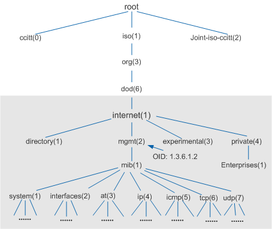
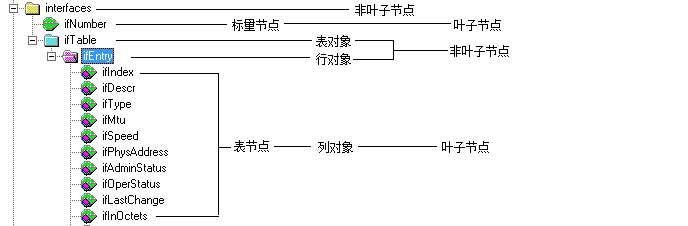

# Mib 编写

> [如何编写MIB文件](https://wenku.baidu.com/view/46184f6ef5335a8102d2203a.html)
>
> [如何编写mib文件](https://wenku.baidu.com/view/8ddf9bd5fbb069dc5022aaea998fcc22bcd143b1.html?rec_flag=default&sxts=1541585847009)
>
> [MIB结构和语法](https://wenku.baidu.com/view/3b725c391711cc7931b716a1.html?sxts=1541585713481)
>
> [MIB2所有节点描述](https://wenku.baidu.com/view/c14d8fc24028915f804dc272.html?sxts=1541585714708)
>
> [mib文件的编写](https://blog.csdn.net/u014207606/article/details/71425523)
>
>

```lua
-- 开始
TEST-GET-MIB DEFINITIONS ::= BEGIN
 
-- 引入部分
IMPORTS
    enterprises
        FROM RFC1155-SMI            
    Integer32,OBJECT-TYPE
        FROM SNMPv2-SMI            
    DisplayString
        FROM SNMPv2-TC
    TEXTUAL-CONVENTION
        FROM SNMPv2-TC; --引用结束，用分号

-- 定义节点
-- enterprises的OID是1.3.6.1.4
testGet    OBJECT IDENTIFIER ::= { enterprises 77695 }
 
getTime     OBJECT IDENTIFIER ::= { testGet   1}
 
getTime OBJECT-TYPE       -- 对象名称
    SYNTAX DisplayString      -- 类型
    MAX-ACCESS read-only      -- 访问方式
    STATUS current            -- 状态
    DESCRIPTION               -- 描述
    "get current time"   
    ::= { testGet  1 }       -- 父节点
 
-- 结束定义
END
```





## 1. MIB file 的开始和结束

所有的 MIB file 都以 `DEFINITIONS ::= BEGIN` 关键字开始，以 `END` 结束。所有添加的节点均应在此之间。

```lua
XXX-TEST-MIB DEFINITIONS ::= BEGIN
...
...
...
END
```

## 2. 模块引用区域

在 MIB 开始关键字后，即时模块引用区域，利用 `IMPORTS` 标识，所有的模块引用群组的引用均使用 `FROM` 关键字说明其出处，引用使用分号（;）结束。

*注：分号，英文全角分号。*

在一个 MIB file 中，所有引用到的数据类型均应有引用。

```lua
IMPORTS
    enterprises
        FROM RFC1155-SMI            
    Integer32,OBJECT-TYPE
        FROM SNMPv2-SMI            
    DisplayString
        FROM SNMPv2-TC
    TEXTUAL-CONVENTION
        FROM SNMPv2-TC;
```

## 3. MIB 核心部分（对象标识，标量节点，表格对象的定义）

### 3.1 对象标识

对象标识用关键字 `OBJECT IDENTIFIER` 声明，它的主要功能是用来将一类功能的对象结合起来。展开或折叠此对象标识即可展开或折叠此类功能的所有对象。

在 ASN.1 中，对象标识符类型描述对象的抽象信息，**MIB 树中的每一个标号是用对象标识符描述的**。

```lua
xxx OBJECT IDENTIFIER ::= { enterprises 77695 }
```

**xxx 是一个子树支，它定义在 enterprises 树枝下**。“77695” 是子树 xxx 在父树 enterprises 下的一个唯一对象标识符。

### 3.2 标量节点

在每一个树支下，可以定义被管理资源的管理对象，其中一类是标量节点（直观的看像树叶的节点）。利用 `OBJECT-TYPE` 定义。其定义的句法如下：

```lua
objectname OBJECT-TYPE          -- 对象名称
	SYNTAX 		(syntax)        -- 类型
    MAX-ACCESS  (access)        -- 访问方式
    STATUS 		(status)        -- 状态
    DESCRIPTION (discription)   -- 描述
    ::= { (parent) (number) }   -- 父节点
```

| 关键字      | 说明                               | 备注                                                         |
| :---------- | :--------------------------------- | :----------------------------------------------------------- |
| objectname  | 被管理对象的名字                   | **必须以小写字母开头**                                       |
| OBJECT-TYPE | 每一个叶子对象必须的关键字         |                                                              |
| syntax      | 被管理对象类型的关键字             | Counter（计数）<br />Gauge（标准）<br />DisplayString（显示字符串）<br />Interger（整数）<br />TimeTicks（时间戳）<br />NetworkAddress（网络地址）<br />IpAddress（IPV4地址） |
| access      | 该节点支持的访问方式               | read-only（只读）<br />read-write（读写）<br />read-create（读和创建）<br />no-accessible（不可访问） |
| status      | 该节点的状态                       | current（当前的）<br />deprecated（反对的）<br />obsolete（废弃的） |
| discription | 对被管理对象的功能、特征等进行描述 |                                                              |

```lua
getTime OBJECT-TYPE            -- 对象名称
    SYNTAX 		DisplayString  -- 类型
    MAX-ACCESS 	read-only      -- 访问方式
    STATUS 		current        -- 状态
    DESCRIPTION                -- 描述
    "get current time"   
    ::= { testGet  1 }         -- 父节点
```

### 3.3 表类型

表类型是一个特殊类型的声明，**表内声明的对象称为列对象，表对象可以看作是一些标量对象的集合**。利用 `SEQUENCE` 和 `SEQUENCE OF` 定义表格和表格中的行， 通常来说，表格对象的名字后面加有后缀 Table，行对象的名字后面加有后缀 Entry。

```lua
tablename OBJECT-TYPE 
	SYNTAX 		SEQUENCE OF Entrytype 
	MAX-ACCESS 	not-accessible 
	STATUS 		current 
	DESCRIPTION (description) 
	:: ={ (parent) (number) } 

entryname OBJECT-TYPE 
	SYNTAX 		Entrytype 
	MAX-ACCESS 	not-accessible 
	STATUS 		current 
	DESCRIPTION description 
	INDEX { index list } 
		:: ={ (tablename) 1 } 

(Entrytype) :: = 
	SEQUENCE { 
    	(column1) (column1type), 
    	(column2) (column1type), 
    	(columnN) (columnNtype) 
	}
```

| 关键字         | 说明     | 备注                                    |
| -------------- | -------- | --------------------------------------- |
| tablename      | 表格名   | xxxTable 首字母小写                     |
| Entrytype      | 表对象名 | XxxEntry首字母大写                      |
| not-accessible | 访问方式 | 此处必须是 not-accessible               |
| entryname      | 行名     | 和 XxxEntry 名相同，首字母小写 xxxEntry |
| description    | 描述信息 |                                         |

```lua
XXX-TEST-MIB DEFINITIONS ::= BEGIN 

IMPORTS 
	enterprises 
		FROM RFC1155-SMI 
	Integer32 
		FROM SNMPv2-SMI 
	DisplayString 
		FROM SNMPv2-TC;

xxx OBJECT IDENTIFIER ::= {enterprises 22566}

zkClassInfoTable OBJECT IDENTIFIER ::= {xxx 1} 
zkClassInfoTable2 OBJECT IDENTIFIER ::= {xxx 2}

zkClassInfoTable OBJECT-TYPE 
	SYNTAX 		SEQUENCE OF ZkClassInfoEntry 
	MAX-ACCESS 	not-accessible 
	STATUS 		current 
	DESCRIPTION 
	” 
	This is test table. 
	” 
	::= {xxx 1}

zkClassInfoEntry OBJECT-TYPE 
	SYNTAX 		ZkClassInfoEntry 
	MAX-ACCESS 	not-accessible 
	STATUS 		current 
	DESCRIPTION 
	” 
	This is teat entry. 
	” 
	INDEX {zkClassInfoIndex} 
	::= {zkClassInfoTable 1}

ZkClassInfoEntry ::= SEQUENCE { 
    zkClassInfoIndex 	Integer32, 
    zkClassInfoSex 		Integer32, 
    zkClassInfoAge 		Integer32, 
    zkCLassInfoName 	DisplayString, 
    zkClassInfoAddress 	DisplayString 
} 
zkClassInfoIndex OBJECT-TYPE 
    SYNTAX 			Integer32 
    MAX-ACCESS 		read-write 
    STATUS 			current 
    DESCRIPTION 
    ” 
    ” 
    ::= {zkClassInfoEntry 1} 

zkClassInfoSex OBJECT-TYPE 
    SYNTAX Integer32 { 
    	man(1), 
    	woman(2) 
    } 
    MAX-ACCESS 		read-write 
    STATUS 			current 
    DESCRIPTION 
    ” 
    ” 
	::= {zkClassInfoEntry 2} 

zkClassInfoAge OBJECT-TYPE 
    SYNTAX 			Integer32 
    MAX-ACCESS 		read-write 
    STATUS 			current 
    DESCRIPTION 
    ” 
    ” 
    ::= {zkClassInfoEntry 3} 

zkCLassInfoName OBJECT-TYPE 
    SYNTAX 			DisplayString 
    MAX-ACCESS 		read-write 
    STATUS 			current 
    DESCRIPTION 
    ” 
    ” 
    ::= {zkClassInfoEntry 4} 

zkClassInfoAddress OBJECT-TYPE 
    SYNTAX 			DisplayString 
    MAX-ACCESS 		read-write 
    STATUS 			current 
    DESCRIPTION 
    ” 
    ” 
    ::= {zkClassInfoEntry 5} 

zkClassInfoTable2 OBJECT-TYPE 
    SYNTAX 			SEQUENCE OF ZkClassInfoEntry2 
    MAX-ACCESS 		not-accessible 
    STATUS 			current 
    DESCRIPTION 
    ” 
    This is test table. 
    ” 
    ::= {xxx 2}

zkClassInfoEntry2 OBJECT-TYPE 
    SYNTAX 			ZkClassInfoEntry2 
    MAX-ACCESS 		not-accessible 
    STATUS 			current 
    DESCRIPTION 
    ” 
    This is teat entry. 
    ” 
    INDEX {zkClassInfoIndex} 
    ::= {zkClassInfoTable2 1}

ZkClassInfoEntry2 ::= SEQUENCE { 
    zkClassInfoSex2 	Integer32, 
    zkClassInfoAge2 	Integer32, 
    zkCLassInfoName2 	DisplayString, 
    zkClassInfoAddress2 DisplayString 
} 

zkClassInfoSex2 OBJECT-TYPE 
    SYNTAX 			Integer32 
    MAX-ACCESS 		read-write 
    STATUS 			current 
    DESCRIPTION 
    ” 
    ” 
    ::= {zkClassInfoEntry2 1} 
END
```

## 4. MIB 分类

MIB 依据数据的通用性可以分为： 

- 标准MIB：rfc1213, rfc1471 , rfc1724, rfc2618 等等 

  注： 通用性 MIB rfc1213 习惯称为 MIB-II 

- 自定义MIB：当标准 MIB 信息不足以描述厂商设备，需要自定义 MIB， 但首先要向 IANA 组织申请编号。

## 5. MIB 管理对象的基本属性

管理对象的四个基本属性如下： 

- 对象类型(Object Type)：定义了一个特定对象的名字，例如 sysUpTime。这个名字只是一个标示符。MIB对象既可以用这个标示符来表示，也可以用相应的 MIB 号码来表示。例如定义 internet OBJECT IDENTIFIER ::= { iso org(3) dod(6) 1 } 那么既可以用internet也可以用字串 .1.3.6.1 来表示这个对象。 

- 语法(Syntax) ：指定了数据类型，例如整数、8 位组串数字（字符串；范围为0至255）、对象标识符(预先定义的数据类型别名）或 NULL。NULL 是留待的后使用的空位。 

- 访问(Access)：表明了这个特定对象的访问级别。合法的值有：只读、读写、只写和不可存取。 

- 状态(Status)：定义了这个对象的实现需要：必备的(被管理节点必须实现该对象); 可选的(被管理对象可能实现该对象):或者已废弃的（被管理设备不需要再实现该对象）

## 6. MIB 两种对象类型

- 标量（Type-Specific Objects）：

  ```lua
  sysDescr OBJECT-TYPE 
  	SYNTAX DisplayString (SIZE(0..255))
  	::= {system 1} 
  OID: mib-2.system.1.0 
  ```

- 表量（Columnar Objects）：

  ```lua
  OID: 
  mib-2.interface.ifTable.ifEntry.ifDescr.2 
  mib-2.interface.ifTable.ifEntry.ifDescr.6
  ```

## 7. 常用对象类型

v1 中的 

- 简单类型：Integer、Octet String、Object Identifier、Null 

- 应用类型：IpAddress、Counter、Gauge、TimeTicks、Opaque 

v2 中的 

- 简单类型：Integer32、OctetString、Object Identifier、Null 

- 应用类型：IpAddress、Counter32、Counter64、Gauge32、Unsigned32、TimeTicks、Opaque、BIT STRING

## 8. 自定义 MIB 基本规则

- 优先采用标准MIB：如果确实无法满足要求才考虑自定义 MIB 

- 采用最新的 SNMPV2－SMI 来定义 MIB：使用最新的 SNMPv2 定义 MIB 可以使得对 MIB 的描述更详尽，可用的类型也更丰富。 

- 层次清晰，定义时顺序合理 — 先定义根节点。 — 在定义对象前，如有自定义类型，应当先书写自定义类型的定义。 — 先定义标量对象，再表量对象。 

- 符合惯例，以标准 MIB 为参考


