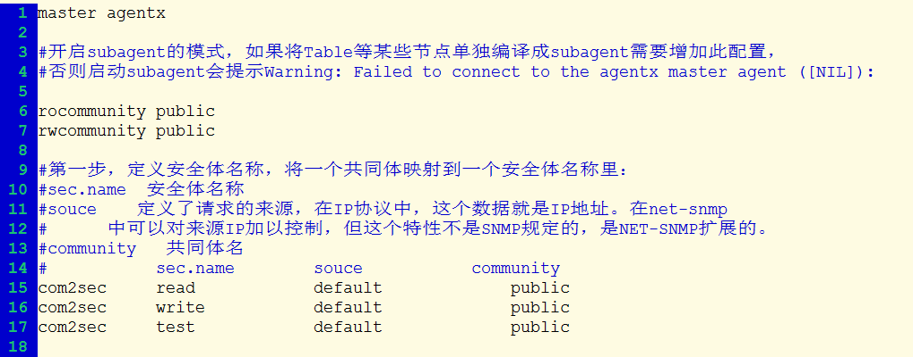
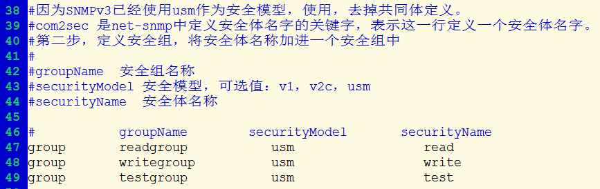
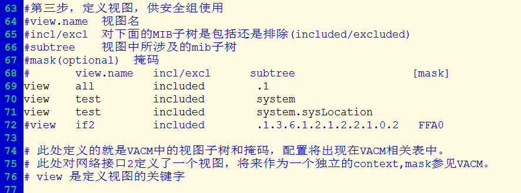
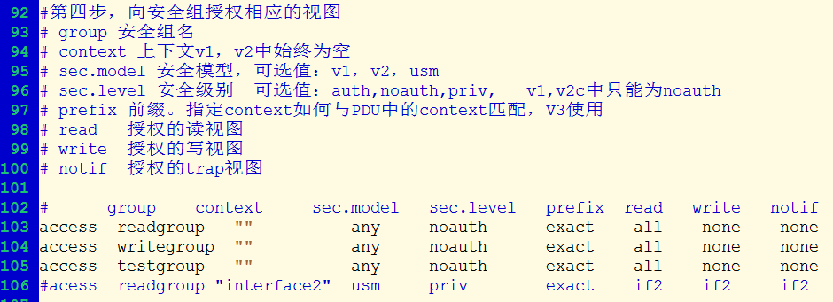
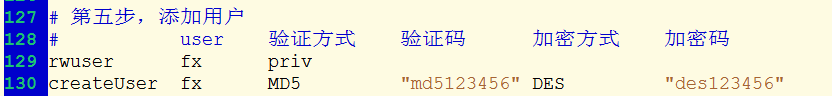
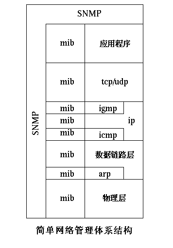
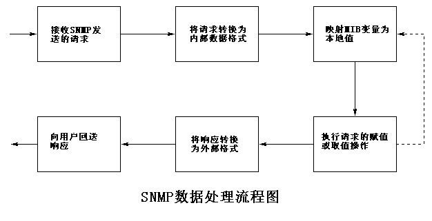
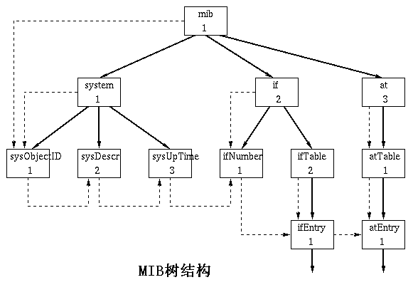
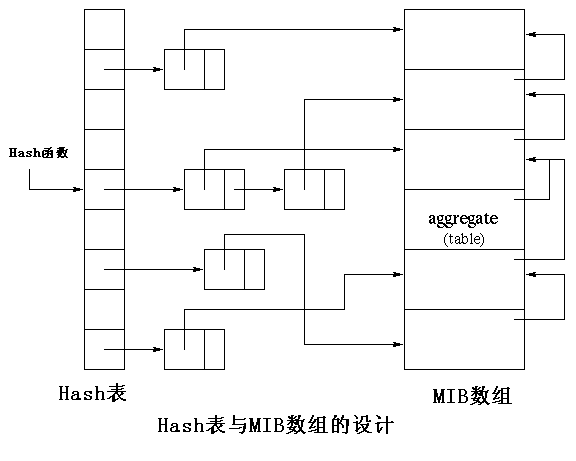

> [SNMP 原理与实战详解***](http://blog.51cto.com/freeloda/1306743)
>
> [SNMP协议详解***](https://blog.csdn.net/shanzhizi/article/details/11606767)
>
> [Net-snmp总结(六)-net-snmp源码分析***](https://blog.csdn.net/JIANGXIN04211/article/details/78478581)
>
> [基于Net-SNMP简单网络管理的开发指南(mib开发)***](http://chichangjing.github.io/2016/02/03/net-snmp-develop.html)
>
> [网络协议篇之SNMP协议（一）——SNMP报文协议](https://blog.csdn.net/zqixiao_09/article/details/77126897) - CSDN
>
> [随笔分类 - snmp](https://www.cnblogs.com/oloroso/category/703615.html)
>
> [NetSNMP开源代码学习——小试牛刀](https://www.cnblogs.com/myblesh/p/6477437.html)
>
> [net-snmp的MIBs扩展（linux下）](https://www.cnblogs.com/oloroso/p/4599501.html)
>
> [Net-snmp总结(四)-net-snmp的MIBs扩展_添加set](https://blog.csdn.net/JIANGXIN04211/article/details/78477890)
>
> [net-snmp 安装与trap调试***](https://blog.csdn.net/backkom_jiu/article/details/79474484)
>
> [GitHub:《深入理解Net-SNMP》源码](https://github.com/chansonZ/Understanding-the-Net-SNMP)
>
> [SNMP功能开发简介 一 net-snmp编译与安装***](https://blog.csdn.net/fuyuande/article/details/82720909) - CSDN
>
> [net-snmp配置文件详解](http://www.cnblogs.com/oloroso/p/4844907.html)
>
> [浅谈 Linux 系统中的 SNMP Trap](https://www.ibm.com/developerworks/cn/linux/l-cn-snmp/index.html)
>
> > [Net-snmp总结(二)-net-snmp配置编译安装](https://blog.csdn.net/JIANGXIN04211/article/details/78444821)
> >
> > [Net-SNMP（V3协议）安装配置笔记](https://blog.csdn.net/wangcg123/article/details/54945521)
> >
> > [SNMP V1 V2 V3版本的联系和区别](https://blog.csdn.net/DaveBobo/article/details/53409470)


## Reference

- [简单网络协议SNMP之移植net-snmp到开发板](https://blog.csdn.net/qivan/article/details/7268192)

- [net-snmp移植添加自己的mib](http://www.voidcn.com/article/p-acydgsbm-bdh.html)

- [移殖net-snmp和应用net-snmp开发详解 -转](http://fp-moon.iteye.com/blog/1555654)

- [openwrt下加载snmp模块](https://www.cnblogs.com/rohens-hbg/p/4778804.html)

- [Snmp学习总结(六)——linux下安装和配置SNMP](https://www.cnblogs.com/xdp-gacl/p/4016524.html)

- [使用 SNMP 监控服务器运行状态](https://zzz.buzz/zh/2016/04/11/monitoring-servers-with-snmp/)

## SNMP 配置详解

> [net-snmp配置文檔詳解](https://hk.saowen.com/a/a6ee358703d7e57a3336b3ab79ce8f9a884a6f67be59a204583ea3e4b8a4ec38)
>
> [net-snmp 安装与trap调试](https://blog.csdn.net/backkom_jiu/article/details/79474484)
>
> [net-snmp配置文件详解](https://www.cnblogs.com/oloroso/p/4844907.html)

```shell
####
# First, map the community name “public” into a “security name”

# sec.name source community
com2sec notConfigUser default public #定义community名称为 public，映射到安全名 notConfigUser，com2sec 相当于 community to security name。community相当于密码。

####
# Second, map the security name into a group name:

# groupName securityModel securityName
group notConfigGroup v1 notConfigUser #定义安全用户名notConfigUser映射到notConfigGroup组。
group notConfigGroup v2c notConfigUser

####
# Third, create a view for us to let the group have rights to: #定义一个view,来决定notConfigUser可以操作的范围。

# make at least snmpwalk -v 1 localhost -c public system fast again. #定义可查看的snmp的范围。
# name incl/excl subtree mask(optional)
view systemview included .1.3.6.1.2.1.1
view systemview included .1.3.6.1.2.1.25.1.1
view all included .1
####
# Finally, grant the group read-only access to the systemview view. #给notConfigGroup组所定义view名 all 以只读权限。

# group context sec.model sec.level prefix read write notif
access notConfigGroup “” any noauth exact all none none
#access notConfigGroup “” any noauth exact mib2 none none

# —————————————————————————–

# Here is a commented out example configuration that allows less
# restrictive access.

# YOU SHOULD CHANGE THE “COMMUNITY” TOKEN BELOW TO A NEW KEYWORD ONLY
# KNOWN AT YOUR SITE. YOU *MUST* CHANGE THE NETWORK TOKEN BELOW TO
# SOMETHING REFLECTING YOUR LOCAL NETWORK ADDRESS SPACE.

## sec.name source community
#com2sec local localhost COMMUNITY
#com2sec mynetwork NETWORK/24 COMMUNITY

## group.name sec.model sec.name
#group MyRWGroup any local
#group MyROGroup any mynetwork
#
#group MyRWGroup any otherv3user
#…

## incl/excl subtree mask
#view all included .1 80

## -or just the mib2 tree-

#view mib2 included .iso.org.dod.internet.mgmt.mib-2 fc
#view mib2 included .iso.org.dod.internet.mgmt.mib-2 fc

## context sec.model sec.level prefix read write notif
#access MyROGroup “” any noauth 0 all none none
#access MyRWGroup “” any noauth 0 all all all
```

有以上这些配置其实已经能够基本满足大多数需求了，还算是比较简单的，配置 SNMP 可以参考以下步骤：

1. 首先定义一个共同体名称(community)，这里是 public ，及可以访问这个 public 的用户名(sec name)，这里是 notConfigUser 。public 相当于用户 notConfigUser 的密码。

```shell
# sec.name                source      community
  com2sec notConfigUser  default       public
```

2.  定义一个组名(groupName)这里是 notConfigGroup，及组的安全级别，把 notConfigGroup 这个用户加到这个组中。

```shell
#  groupName         securityModel    securityName
group   notConfigGroup   v1           notConfigUser  
group   notConfigGroup   v2c          notConfigUser
```

3. 定义一个可操作的视图(view)名， 这里是 all，范围是 .1。

```
# name           incl/excl     subtree         mask(optional)
  view  all      included        .1
```

4. 定义 notConfigUser 这个组在 all 这个视图范围内可做的操作，这时定义了 notConfigUser 组的成员可对 .1 这个视图做只读操作。

```
# group      context sec.model sec.level  prefix   read   write  notif
 access  notConfigGroup ""      any       noauth    exact  all  none none
```

这样对 snmpd.conf 文件就基本完成了，用 `service snmpd restart` 重启 snmpd 服务。

之后，我们需要一个测试，验证 SNMP 配置的正确性。在监控主机中执行以下命令：

```shell
[root@chenyi Packages]# snmpwalk -v 1 192.168.1.220 -c public system
Timeout: No Response from 192.168.1.220
[root@chenyi Packages]# snmpwalk -v 1 192.168.1.220 -c public system
SNMPv2-MIB::sysDescr.0 = STRING: Linux chenyi 2.6.32-279.el6.i686 #1 SMP Fri Jun 22 10:59:55 UTC 2012 i686
SNMPv2-MIB::sysObjectID.0 = OID: NET-SNMP-MIB::netSnmpAgentOIDs.10
DISMAN-EVENT-MIB::sysUpTimeInstance = Timeticks: (797) 0:00:07.97
SNMPv2-MIB::sysContact.0 = STRING: Root <root@localhost> (configure /etc/snmp/snmp.local.conf)
SNMPv2-MIB::sysName.0 = STRING: chenyi
.....................
```

上述信息说明 SNMP 已经正常工作了。

现在我们在目标主机上来写一些脚本来获取 Memory、CPU、DiskIO 等状态。

Memory 脚本：

```shell
#!/bin/sh
/usr/bin/free -m | grep Mem |awk '{print $4}'
/usr/bin/free -m | grep Mem |awk '{print $2}'
[root@chenyi ~]# sh memory.sh
809
1006
```

CPU 脚本：

```shell
#!/bin/sh
idle=`sar  -u 1 3 | grep Average | awk '{print $6}'`
used=`echo "101 - $idle" | bc -l -s`
echo $used
echo $idle
```

Disk I/O 脚本：

```shell
#!/bin/sh
used1=`sar -d 1 3 | tail -1 | awk '{print $4}'`
used2=`echo "$used1 / 2" | bc -l`
echo $used2
echo $used2
```

现在我们已经能得到这数据了，怎么才能让监控主机通过 snmpd 得到这些数据呢？可以在目标主机的`/etc/snmp/snmpd.conf`文件中加入这些配置：

```shell
exec .1.3.6.1.4.1.2021.53 memory /bin/sh /root/memory.sh
exec .1.3.6.1.4.1.2021.54 cpu /bin/sh /root/cpu.sh
exec .1.3.6.1.4.1.2021.55 disk /bin/sh /root/disk.sh
[root@chenyi ~]# service snmpd restart
停止 snmpd：                                               [确定]
正在启动 snmpd：                                           [确定]
```

这样在监控主机上运行：

```shell
[root@chenyi ~]# snmpwalk -v 1 192.168.1.220 -c public .1.3.6.1.4.1.2021.53
UCD-SNMP-MIB::ucdavis.53.1.1 = INTEGER: 1
UCD-SNMP-MIB::ucdavis.53.2.1 = STRING: "memory"
UCD-SNMP-MIB::ucdavis.53.3.1 = STRING: "/bin/sh /root/memory.sh"
UCD-SNMP-MIB::ucdavis.53.100.1 = INTEGER: 0
UCD-SNMP-MIB::ucdavis.53.101.1 = STRING: "442"
UCD-SNMP-MIB::ucdavis.53.101.2 = STRING: "1006"
UCD-SNMP-MIB::ucdavis.53.102.1 = INTEGER: 0
```

其中 UCD-SNMP-MIB::ucdavis.53.101.1 = STRING: "442" 中的 442 就是 mem.sh 输出的第一个数据，1006 是 mem.sh 输出的第二个数据。

略作修改：（此处参照其他文章）

```shell
[root@chenyi ~]# snmpwalk -v 1  192.168.1.220 -c public .1.3.6.1.4.1.2021.53 | grep 53.101 | awk -F\" '{print $2}'
443
1006
```

我们已经通过 snmpd 从监控主机上得到了目标主机上内存使用状态的两个参数，其它脚本也是一样的。

来个配置:

```shell
#定义一个使用 community 'myCommunity' 和源网络 172.17.1.0/24 的用户 'myUser'
com2sec myUser 172.17.1.0/24 myCommunity

#将 myUser 加到 'myGroup' 组，定义组权限
group    myGroup    v1        myUser
group    myGroup    v2c        myUser

view all included .1

access myGroup    ""    any    noauth     exact    all    all    none
```

---

## NET-SNMP 简介

> [浅谈 Linux 系统中的 SNMP Trap](https://www.ibm.com/developerworks/cn/linux/l-cn-snmp/index.html)

在 Linux 系统中，我们可以选择 net-snmp 来处理绝大多数和 SNMP 相关的工作。

NET-SNMP 是一种开放源代码的 SNMP 协议实现。它支持 SNMP v1, SNMP v2c 与 SNMP v3，并可以使用 IPV4 及 IPV6 。也包含 SNMP Trap 的所有相关实现。Net-snmp 包含了 snmp 实用程序集和完整的 snmp 开发库。

用户使用 net-snmp 提供的工具，可以完成很多关于 SNMP 的操作，具体说来，包括以下一些命令行应用程序：

1. 一些应用程序可以用来从支持 SNMP 的设备获得数据。其中 `snmpget`  可以支持独立请求，比如：

   ```shell
   root@CELL:/# snmpget -v 1 -c demopublic test.net-snmp.org system.sysUpTime.0
   DISMAN-EVENT-MIB::sysUpTimeInstance = Timeticks: (149359961) 17 days, 6:53:19.61
   ```

   该命令获得单个独立的 MIB 对象 system.sysUpTime.0 的值。

2. 而 `snmpwalk` 则用来支持重复请求。

   ```shell
   root@CELL:/# snmpwalk -v 2c -c demopublic test.net-snmp.org system 
   SNMPv2-MIB::sysDescr.0 = STRING: test.net-snmp.org
   SNMPv2-MIB::sysObjectID.0 = OID: NET-SNMP-MIB::netSnmpAgentOIDs.10
   DISMAN-EVENT-MIB::sysUpTimeInstance = Timeticks: (149367810) 17 days, 6:54:38.10
   SNMPv2-MIB::sysContact.0 = STRING: Net-SNMP Coders <net-snmp-coders@lists.sourceforge.net>
   SNMPv2-MIB::sysName.0 = STRING: test.net-snmp.org
   SNMPv2-MIB::sysLocation.0 = STRING: Undisclosed
   SNMPv2-MIB::sysORLastChange.0 = Timeticks: (2) 0:00:00.02
   SNMPv2-MIB::sysORID.1 = OID: SNMPv2-MIB::snmpMIB
   SNMPv2-MIB::sysORID.2 = OID: SNMP-VIEW-BASED-ACM-MIB::vacmBasicGroup
   SNMPv2-MIB::sysORID.3 = OID: SNMP-MPD-MIB::snmpMPDCompliance
   SNMPv2-MIB::sysORID.4 = OID: SNMP-USER-BASED-SM-MIB::usmMIBCompliance
   SNMPv2-MIB::sysORID.5 = OID: SNMP-FRAMEWORK-MIB::snmpFrameworkMIBCompliance
   SNMPv2-MIB::sysORDescr.1 = STRING: The MIB module for SNMPv2 entities
   SNMPv2-MIB::sysORDescr.2 = STRING: View-based Access Control Model for SNMP.
   SNMPv2-MIB::sysORDescr.3 = STRING: The MIB for Message Processing and Dispatching.
   SNMPv2-MIB::sysORDescr.4 = STRING: The management information definitions for the SNMP User-based Security Model.
   SNMPv2-MIB::sysORDescr.5 = STRING: The SNMP Management Architecture MIB.
   SNMPv2-MIB::sysORUpTime.1 = Timeticks: (2) 0:00:00.02
   SNMPv2-MIB::sysORUpTime.2 = Timeticks: (2) 0:00:00.02
   SNMPv2-MIB::sysORUpTime.3 = Timeticks: (2) 0:00:00.02
   SNMPv2-MIB::sysORUpTime.4 = Timeticks: (2) 0:00:00.02
   SNMPv2-MIB::sysORUpTime.5 = Timeticks: (2) 0:00:00.02
   ```

   上面的命令返回所有 system 节点以下的 MIB 对象的值。

3. 命令 `snmpset` 对支持 SNMP 的设备配置属性。如下例所示：

   ```shell
   root@CELL:/# snmpget -v 1 -c demopublic test.net-snmp.org ucdDemoPublicString.0 
    UCD-DEMO-MIB::ucdDemoPublicString.0 = "hi there!"
   root@CELL:/# snmpset -v 1 -c demopublic test.net-snmp.org ucdDemoPublicString.0 s "Hello, world!"
    UCD-DEMO-MIB::ucdDemoPublicString.0 = "Hello, world!"
   root@CELL:/# snmpget -v 1 -c demopublic test.net-snmp.org ucdDemoPublicString.0 
    UCD-DEMO-MIB::ucdDemoPublicString.0 = "Hello, world!"
   ```

4. 命令 `snmpstatus` 可以从支持 SNMP 的设备获取特定的信息。比如下面的命令从目标系统上获得类似 netstat 的信息：

   ```shell
   root@CELL:/# snmpnetstat -v 2c -c public -a testhost 
    
   Active Internet (tcp) Connections (including servers) 
   Proto Local Address Foreign Address           (state) 
   tcp   *.echo         *.*                      LISTEN 
   tcp   *.discard      *.*                      LISTEN 
   tcp   *.daytime      *.*                      LISTEN 
   tcp   *.chargen      *.*                      LISTEN 
   tcp   *.ftp          *.*                      LISTEN 
   tcp   *.telnet       *.*                      LISTEN 
   tcp   *.smtp         *.*                      LISTEN 
   Active Internet (udp) Connections 
   Proto Local Address 
   udp    *.echo 
   udp    *.discard 
   udp    *.daytime 
   udp    *.chargen 
   udp    *.time
   ```

Net-snmp 还提供了接收 SNMP traps 的守护程序 snmptrapd。可以将选定的 SNMP 消息记录到系统日志 syslog,NT 事件日志，或者文本文件中。或是转发到其它的 SNMP 管理程序 , 也可以传给外部的应用程序。本文的后面我们将用它来演示 SNMP Trap 的收发。

Net-snmp 还提供了一个回应 SNMP 查询的客户端 snmpd. 它集成了大量 SNMP 的模块 . 并可通过动态链接库 , 外部脚本与命令 , 多路 SNMP 技术 (SMUX), 以及可扩客户端协议 (AgentX) 进行扩展 .

此外，net-snmp 还包含了用来开发 SNMP 应用程序的程序库。支持 C 与 perl 的 APIs。因此您可以使用 net-snmp 的工具集完成一些关于 SNMP 的工作，也可以依赖 net-snmp 提供的开发包自己写程序开发您所需要的 snmp 应用。

## net-snmp配置文件详解

> [net-snmp配置文件详解](http://www.cnblogs.com/oloroso/p/4844907.html)

net-snmp 的配置文件是有一定的层次结构的，配置起来也很方便。网上找了很多资料，大概把这个配置文件的各个信息搞懂了一点。其实在 net-snmp 的 EXAMPLE.conf 文件中对齐有详细的描述，不过是英文的。

### 1. 开启子代理模式

开发 net-snmp 子代理后，如果想要使用它，必须开启子代理功能。如果不开启，子代理运行的时候将会报错 

```shell
Warning: Failed to connect to the agentx master agent ([NIL]) 
```

### 2. 设置 snmpd 监听的地址端口

snmpd 默认是监听本地所有的IP地址的 UDP 161端口 等待 snmp 请求。如果不希望使用默认的监听设置，可以使用自定义的选项

```shell
#  Listen for connections from the local system only
# 只监听本地的连接
agentAddress  udp:127.0.0.1:161

#  Listen for connections on all interfaces (both IPv4 *and* IPv6)
# 监听所有接口的连接
#agentAddress udp:161,udp6:[::1]:161
```

### 3. 定义安全体名和共同体名称

共同体这个是 SNMPv2 中的，如果只是使用 SNMPv3 协议，可以不需要。

```shell
rocommunity    #共同体名
rwcommunity    #共同体名
```

- 使用 rocommunity 来定义一个只读权限的共同体
- 使用 rwcommunity 来定义一个读写权限的共同体。

定义完共同体之后就要定义一个安全体，并把共同体映射到一个安全体中去。安全体用于控制外部访问的来源的。

使用 com2sec 关键字来定义安全体。

```shell
#            sec.name        souce            community
com2sec        read            default                public
com2sec        write            default                public
com2sec        test            default                public
```

```
1. com2sec
命令格式一：com2sec   [-Cn context]   sec.name   source   community
功能： map an SNMPv1 or SNMPv2c community string to a security name，即将实体(community)字符串映射为安全的
名字：v1 和 v2 版本都是明文密码，也就无所谓安全性了。v3 中增加了安全性。
参数说明：-Cn context：可选的，在v3版本中使用
    sec.name： 内部映射的名字，字符串，后面用到
    community：实体字符串，外部使用的名字
    source：可以访问的ip地址范围，默认值"default”，即任何ip都可以访问。
    也可以限制ip范围，有两种方式：IP/MASK和IP/BITS
        IP/MASK：10.10.10.0/255.255.255.0
        IP/BITS ：10.10.10.0/24：只有ip地址在10.10.10.0
        mask为24个1，即255.255.255.0
命令格式二：com2sec6  [-Cn context] sec.name source community
    针对ipv6，其他和com2sec相同
命令格式三：com2secunix [-Cn context] sec.name sockpath community
    只限本地socket可以访问
------------------------------------------------------------------------
因为 SNMPv3 已经使用 usm 作为安全模型，使用，去掉共同体定义。
com2sec 是 net-snmp 中定义安全体名字的关键字，表示这一行定义一个安全体名字。
```



### 4. 定义安全组

定义完安全体之后，就要定义安全组了。

- 安全体是用于控制访问的的来源的

- 安全组就是控制安全体中允许的来源的访问授权模式的

```
com2sec 是 net-snmp 中定义安全体名字的关键字，表示这一行定义一个安全体名字。
第二步，定义安全组，将安全体名称加进一个安全组中

groupName  安全组名称
securityModel 安全模型，可选值：v1，v2c，usm
securityName  安全体名称

#            groupName         securityModel         securityName
group        readgroup            usm                    read
group        writegroup            usm                    write
group        testgroup            usm                    test

group 是定义安全组的关键字
2. group
命令格式：group   groupName   securityModel   sec.name
功能：将 sec.name 映射到一个 group 中，组中具有相同的存取权限。组中至少有两个
    sec.name，如果只有一个 sec.name，也会被解释为两个。即有两个相同的
参数说明：groupName：组名
           securityModel：v1、v2c、usm、tsm、ksm 其一
```



### 5. 定义视图，供安全组使用

定义完安全组后，需要定义一个视图。

- 视图就是这个安全体的可见范围。

对于每一个安全体，需要向其授权一些视图，**视图确定了可以访问那些节点**。

```
第三步，定义视图，供安全组使用
view.name  视图名
incl/excl  对下面的 MIB 子树是包括还是排除(included/excluded)
subtree    视图中所涉及的 mib 子树
mask(optional)  掩码
#        view.name    incl/excl       subtree                   [mask]
view    all            included        .1      
view    test           included        system      
view    test           included        system.sysLocation      
#view    if2            included        .1.3.6.1.2.1.2.2.1.0.2   FFA0

此处定义的就是 VACM 中的视图子树和掩码，配置将出现在 VACM 相关表中。
此处对网络接口 2 定义了一个视图，将来作为一个独立的 context,mask 参见 VACM。
view 是定义视图的关键字

3. view
命令格式：view viewName type oid[mask]
功能：定义一个view，表示整个OID树的子树，同一个子树可以定义多个view
参数说明:    viewName：view名字
           type：有两个值:include 和 exclude
           oid：可以访问的oid
           [mask]：对oid的mask
               例如：view all include 1.3.6.1.2.1.4  0xf0
               0xf0：1111 0000，即访问的oid的前4位必须是1.3.6.1，否则不能访问，即
               可以访问1.3.6.1下所有的子oid
```



### 6. 向安全组授权相应的视图

```
第四步，向安全组授权相应的视图
group 安全组名
context 上下文 v1，v2 中始终为空
sec.model 安全模型，可选值：v1，v2，usm
sec.level 安全级别  可选值：auth,noauth,priv,     v1,v2c中只能为 noauth
prefix 前缀。指定 context 如何与 PDU 中的 context 匹配，V3 使用
read   授权的读视图
write  授权的写视图
notif  授权的 trap 视图

#       group    context        sec.model    sec.level    prefix    read   write   notif
access  readgroup    ""            any        noauth        exact     all    none    none
access  writegroup    ""            any        noauth        exact     all    none    none
access  testgroup    ""            any        noauth        exact     all    none    none
#acess  readgroup "interface2"    usm        priv        exact     if2    if2        if2  

4. access
命令格式：access groupName context model level prefx read write notify
功能：设置访问某一个 view 的存取权限
参数说明:    groupName：控制存取权限的组名
            context：v1 和 v2c 版本，context 必须设置为 ""
            model：v1、v2c、usm、tsm、ksm
            最后 3 中是 v3 版本的授权模式，usm（User-Based Security Model）是默认授权模式，tsm 用于 SSH or DTLS，ksm 用于支持 Kerberos
            level：可以去 3 种值：noauth、auth、priv
            	noauth：允许无权限访问（v1，v2c使用）
            	auth：必须有权限才能访问
            	priv：强制加密访问
            prefx：exact or prefix
            read、write、notify：指明某一个 view 的权限是否可以 `GET*`, `SET*`、
            `TRAP/INFORM`，如果该 view 不能 read，则置none  
```



### 7. 添加用户（仅限 SNMPv3）

SNMPv3 使用了用户加密鉴权的认证方式，所以需要创建相关的用户。这里也可以用 net-snmp-config –create-snmpv3-user 来实现。

创建用户使用 createUser 关键字来进行。后面的参数依次是用户名、验证方式、验证码、加密方式、加密码

创建的用户需要指明用户的权限，使用关键字 rouser 和 rwuser 来操作。

- rouser 用于指定用户的权限为只读，如果后面加上 priv 来指明需要加密。可以使用 auth 来指明需要认证。

- rwuser 用于指定用户的权限为读写，其他的与上面一致。

```
第五步，添加用户
#           user    验证方式        验证码       加密方式        加密码
createUser  fx        MD5        "md5123456"    DES        "des123456"
createUser  fxr       MD5        "md5123456"
#用户的权限设置
rwuser　　　　fx　　priv　　#读写用户，用户名fx，指明需要加密
rouser　　　　fxr　　　　　　#只读用户

    #rouser [-s SECMODEL] USER [noauth|auth|priv [OID | -V VIEW [CONTEXT]]]
    #rwuser [-s SECMODEL] USER [noauth|auth|priv [OID | -V VIEW [CONTEXT]]]
```



### SNMP Trap发送目的地设置

以上都是对 SNMP 代理程序的外部请求的相关设置。SNMP 代理还有一个重要的功能就是主动向网管端发送 “通知”。

对此需要指定网关端的目的地址。

使用 snmpsink 来指定发送 SNMPv1 版本的 Trap 的目的地址和共同体名称

使用 snmp2sink 来指定发送 SNMPv2 版本的 Trap 的目的地址和共同体名称

使用 informasink 来指定发送 INFORMs 的目的地址和共同体名称

使用 trappsess 来指定发送 SNMPv3 版本的 Trap 的相关信息。其中引擎 ID 和用户名，验证方式，验证码等都必须和接收 trap 的网关软件端设置的一致。

```shell
#   发送 SNMPv1  traps
trapsink     localhost public
#   发送 SNMPv2c traps
trap2sink    localhost public
#   发送 SNMPv2c INFORMs
informsink   localhost public
#   发送SNMPv3 traps
#trapsess -v 2 -u 用户名  -e  引擎ID       -a 验证方式 -A 验证码  -l  鉴权方式   目的IP
trapsess -v 3 -u myuser -e 0x010203040506 -a MD5 -A 111111111 -l authNoPriv 192.168.1.108
```

## NET-SNMP开发——日志输出

net-snmp 的日志输出功能是很强大的，与日志输出相关函数声明在 `net-snmp-5.7.3\include\net-snmp\library\snmp_logging.h` 文件中，定义在 `net-snmp-5.7.3\snmplib\snmp_logging.c` 文件中。

具体实现就不说了，可以自己看源码。

net-snmp 的日志功能默认将日志写入到 `/var/log/snmpd.log` 文件中

### 1. snmp log 类型

net-snmp 中将日志分为 8 个类型(一个警告 warning，三个信息 information，四个错误 error)，具体的宏定义如下

```c++
/* error types */
#define LOG_EMERG       0       /* system is unusable */
#define LOG_ALERT       1       /* action must be taken immediately */
#define LOG_CRIT        2       /* critical conditions 临界条件*/
#define LOG_ERR         3       /* error conditions 错误条件*/
/* warning type */
#define LOG_WARNING     4       /* warning conditions 预警条件*/
/* information types */
#define LOG_NOTICE      5       /* normal but significant condition 正常但意义重大*/
#define LOG_INFO        6       /* informational 信息*/
#define LOG_DEBUG       7       /* debug-level messages 调试级别的消息*/
```

注意：这些严重等级的分类是与标准的 UNIX/LINUX 中的 syslog 一致的。

- `System is unusable emergencies alerts` 极其紧急的错误 

- `Action must be taken immediately` 需立即纠正的错误 

- `Critical conditions` 关键信息 

- `Error conditions` 需关注但不关键的错误 
- `Warning conditions`警告，可能存在某种差错 
- `Normal but significant condition` 需注意的信息 
- `Informational` 一般提示信息 
- `Debug-level messages`调试信息

### 2. 日志输出函数

#### 2.1 snmp_log

```c++
int snmp_log(int priority, const char *format, ...)
```

这个函数实际上调用的是 `snmp_vlog` 函数，这个函数成功返回 0，当不能格式化日志字符串时返回 1，当动态内存不能分配返回 2，如果日志缓冲区的长度大于 1024 字节。这些消息将以 LOG_ERR 类型直接写入日志文件。

调用示例

```c++
snmp_log(LOG_ERR, "%s: Error %d out-of-range\n", s, errno);
```

#### 2.2 snmp_log_perror

```C++
void snmp_log_perror(const char *s)
```

实际上是先调用 `char* error = strerror(errno);` 获取 `errno` 的信息，然后使用 `snmp_log` 来输出参数 `s` 和 `error` 字符串。 调用示例

```c++
snmp_log_perror("init error");
```

#### 2.3 snmp_log_string

```c++
void snmp_log_string(int priority, const char *str)
```

调用示例

```C++
snmp_log_string(LOG_ERR, "Could not format log-string\n");
```

## net-snmp配置: snmp v3 的安全配置

### 1. 增加snmp v3用户

#### 1.1 增加 认证且加密只读账号(authPriv)

```shell
$ sudo service snmpd stop   #停止snmpd服务
$ sudo net-snmp-create-v3-user -ro -A auth123456 -X priv123456 -a MD5 -x DES fx     #创建snmpv3用户

adding the following line to /var/net-snmp/snmpd.conf:
   createUser fx MD5 "auth123456" DES priv123456
adding the following line to /usr/local/net-snmp/share/snmp/snmpd.conf:
   rouser fx
```

#### 1.2 增加 认证且加密的读写账户

```shell
$ sudo /usr/local/net-snmp/bin/net-snmp-create-v3-user  -A auth123456 -a MD5 -X priv123456 -x DES fxw 
adding the following line to /var/net-snmp/snmpd.conf:
   createUser fxw MD5 "auth123456" DES priv123456
adding the following line to /usr/local/net-snmp/share/snmp/snmpd.conf:
   rwuser fxw

```

#### 1.3 增加 认证但不加密只读账户(authNoPriv)

```shell
$ sudo net-snmp-create-v3-user -ro -A auth123456 -a MD5 fxa
adding the following line to /var/net-snmp/snmpd.conf:
   createUser fxa MD5 "auth123456" DES
adding the following line to /usr/local/net-snmp/share/snmp/snmpd.conf:
   rouser fxa
```

注意，这个操作会修改默认的 `snmpd.conf` 文件。

##### 1.3.1 参数说明

- `-ro`: 用户读写权限，表示用户fx为只具有读权限
- `fx`：用户名
- `-a MD5`: 认证方式，MD5散列方式
- `-A auth123456`：设置认证密码，密码必须大于8个字符
- `-x DES`: 加密方式，这边支持AES、DES两种
- `priv123456`：加密口令，必须大于8位

备注：增加用户的时候，snmp 必须关闭，否则有如下报错

```shell
Apparently at least one snmpd demon is already running.
 You must stop them in order to use this command.
Apparently at least one snmpd demon is already running.
 You must stop them in order to use this command.
```

### 2. 重新启动 snmpd

```shell
$ sudo service snmpd start
```

### 3. 测试一下

#### 3.1 测试认证且加密只读账户 fx

```shell
$ snmpwalk  -v3  -u fx -a MD5 -A auth123456 -x DES -X priv123456 -l authPriv 127.0.0.1 sysUpTime
DISMAN-EVENT-MIB::sysUpTimeInstance = Timeticks: (93687) 0:15:36.87
```

#### 3.2 测试认证且加密读写账户 fxw

注意，下面的节点 `confNewVersion.0` 是一个自定义的读写节点

```shell
#认证且加密方式set
$ snmpset -v3 -u fxw -a MD5 -A auth123456 -x DES -X priv123456 -l authPriv 127.0.0.1 confNewVersion.0 s "12345"
SNMP-VC-MIB::confNewVersion.0 = STRING: "12345"

#认证但不加密方式set
$ snmpset -v3 -u fxw -a MD5 -A auth123456  -l authNoPriv 127.0.0.1 confNewVersion.0 s "12345"
SNMP54-VideoCommand-MIB::confNewVersion.0 = STRING: "12345"
```

#### 3.3 测试认证不加密只读账户 fxa

```shell
$ snmpwalk  -v 3 -u fxa -a MD5 -A auth123456 -l authNoPriv 127.0.0.1 sysUpTime
DISMAN-EVENT-MIB::sysUpTimeInstance = Timeticks: (8215) 0:01:22.15
```

#### 3.4 注意事项

注意，对于 `snmpget/set` 操作，代理端配置的账户与管理端使用的时候可以不完全一致。但是对于 `set` 操作，不能使用 `noAuthNoPriv` 方式，否则报错。

- 对于认证且加密的账户，`snmpget/walk/get`可以使用三种级别的安全方式，分别为`noAuthNoPriv`（不认证也不加密）、`authNoPriv`（认证但是不加密）、`authPriv`（既认证又加密）
- 对于认证但不加密的账户，`snmpget/walk/get`可以使用两种级别的安全方式，分别为noAuthNoPriv（不认证也不加密）、authNoPriv（认证但是不加密）

##### 3.4.1 snmpwalk 权限设置导致的超时

```shell
$ snmpwalk  -v 3 -u fxa -a MD5 -A auth123456 -x DES -X priv123456 -l authPriv 127.0.0.1 sysUpTime
Timeout: No Response from 127.0.0.1
```

##### 3.4.2 snmpset 安全等级设置与认证和加密设置不对等时候的报错

```shell
$ snmpset -v3 -u fxw -a MD5 -A auth123456  -l authPriv 127.0.0.1 confNewVersion.0 s "12345"snmpset: USM generic error (Sub-id not found: (top) -> confNewVersion)
```

##### 3.4.3 snmpset 使用 noAuthNoPriv 不认证不加密方式报错

```shell
$ snmpset -v3 -u fxw  -l noAuthNoPriv 127.0.0.1 confNewVersion.0 s "12345"
Error in packet.
Reason: authorizationError (access denied to that object)
```

## SNMP 结构

### 1. 体系结构

- 所有在应用层下的 TCP/IP 层都有它自己的 SNMP 结构
- 硬件制造商可以在它的产品中实现了相应的管理结构
- 从图上可以看到有许多 MIB，但服务器只有一台



### 2. 服务器处理过程

- 基站发送的请求仅有两种类型，取值和赋值
- 一个请求可以进行多个操作



### 3. ASN.1

- ASN.1是用于定义MIB对象的高层计算机语言
- SNMP使用ASN.1子集的基本类型：整数，字符串，对象标识符，序列和空值
- BER用于将ASN.1编译为SNMP可以传送的字符串，在SNMP代理间传送。对于变量ASN.1使用词典顺序进行有序排列，并定义了层次状态的名字空间
- 词典式排序可以使服务器不需要知道被请求的变量的大小而直接响应请求。
- 所有的变量都有后后缀`iso.org.dod.internet.mgmt.mib`或`1.3.6.1.2.1`



### 4. PDU

- 客户可以发送以下三个基本命令：`设置，读取和取下一个`
- 设置和读取指令使服务器进行直接变量映射
- 取下一个指令指定要取的变量名，服务器根据变量当前所排的字典序返回指定变量名下一个变量的值，在不知道表大小的时候这条指令十分有用
- 在层次的树状结构中可以一定前进一个结点，当然这样会因为要多次发送请求和相应于请求的数据而对网络造成不必要的压力，也可以在树状结构中一次取得多个点的数据
- 如果发生意外情况，客户会向服务器的162端口发送一个消息，告知服务器指定的变量值发生了变化。通常由服务器请求而获得的数据由服务器的161端口接收。

### 5. Hash表设计

- Hash表用于快速查找变量，Hash表是一个指针数组，每个数组指向一组具有相同Hash值的结点。
- 如果需要查找MIB变量的值，服务器根据变量名的数字表示经过Hash函数计算后得到数组索引值，通过查找数组相应元素指向的结点可以找到需要的数据
- 而在MIB中的每个元素除了使用字典序进行排序之外，还拥有一个指向下一个元素的指针，这个指针在执行取下一个指令时特别有用，在其中还包括了ASN.1名称，和能够作于此变量的所有函数的地址以及内部变量地址
- 在服务器启动时初始化这些变量的值



### 6. SNMP总结

SNMP 是一种易于实现的基本的网络管理工具，它能够满足短期的管理要求。因为基于 OSI 的管理协议现在进展缓慢，所以它起到了一个重要的补充作用。

SNMP 协议提供了用于定义网络信息和框架和用于交换信息的协议标准。SNMP 模型引入了管理器和代理的概念，管理器指的是以人类管理员身份负责所有网络（或部分网络）的软件。代理指的被管理设备中的软件，它用以完成管理器所需要进行的局部管理和应急通知管理器的功能。

## net-snmp子代理(SubAgent)编写

> [net-snmp子代理(SubAgent)编写](https://www.cnblogs.com/oloroso/p/4708581.html)

## SNMP报文抓取与分析

> [SNMP报文抓取与分析(一)](https://www.cnblogs.com/oloroso/p/4671184.html)
>
> [SNMP报文抓取与分析(二)](https://www.cnblogs.com/oloroso/p/4682502.html)

## net-snmp的MIBs扩展

> [net-snmp的MIBs扩展](https://www.cnblogs.com/oloroso/p/4599501.html)

## 关于SNMP的MIB文件的语法简述

> [关于SNMP的MIB文件的语法简述](https://blog.csdn.net/shanzhizi/article/details/15340305)
>
> [MIB结构和语法](https://wenku.baidu.com/view/3b725c391711cc7931b716a1.html)
>
> [Net-snmp总结(四)-net-snmp的MIBs扩展_添加set](https://blog.csdn.net/JIANGXIN04211/article/details/78477890)

## 华为 -- MIB简介

> [MIB简介](http://support.huawei.com/enterprise/docinforeader!loadDocument1.action?contentId=DOC1000097258&partNo=10042)

## SNMP 协议介绍

> [SNMP协议详解](https://blog.csdn.net/shanzhizi/article/details/11606767)
>
> [网络协议篇之SNMP协议（一）——SNMP报文协议](https://blog.csdn.net/zqixiao_09/article/details/77126897)
>
> [基于Net-SNMP简单网络管理的开发指南](http://chichangjing.github.io/2016/02/03/net-snmp-develop.html)
>
> [Net-snmp总结(六)-net-snmp源码分析](https://blog.csdn.net/JIANGXIN04211/article/details/78478581)
>
> [net-snmp学习总结](https://blog.csdn.net/jiangxin04211/article/category/7269194)
>
> [SNMP 原理与实战详解](http://blog.51cto.com/freeloda/1306743)

